# Go语言学习

## 1 Golang 的概述

### 1.1 什么是程序

> 程序就是完成某个功ƒ能的指令集合

### 1.2 Golang 的三个创始者

- Ken Thompson（肯·汤普逊）:1983年图灵奖、1998年美国国家技术奖得主，他与Dennis Ritchie是Unix系统的原创者。Thompson也发明了C语言、B语言，同时也是C语言的主要发明人。
- Rob Pike（罗布·派克）： 加拿大人，曾是贝尔实验室的Unix团队和Plan 9操作计划的成员。他与Thompson公事多年，并共创出广泛使用的UTF-8字元编码。（ps：Go语言的图标-gopher 囊地鼠，是Rob Pike老婆制作的）
- Robert Griesemer：曾协助制作Java的HotSpot编译器，和Chrom浏览器的JavaScript引擎V8.


### 1.3 Google为什么会创建 Golang？

2007 年 9 月 20 日的下午，在谷歌山景城总部的一间办公室里，谷歌的大佬级程序员 Rob Pike在等待一个 C++ 项目构建的过程中和谷歌的另外两个大佬级程序员 Robert Griesemer和 Ken Thompson进行了一次有关设计一门新编程语言的讨论。

- 计算机硬件技术更新频繁，性能提高很快。目前主流的编程语言发展明显落后于硬件，不能合理利用**多核多CPU的优势提升软件系统性能**。
- 软件系统复杂度越来越高，维护成本越来越高，目前缺乏一个足够简洁高效的编程语言。
- 企业运行维护很多c/c++的项目，C/C++程序运行速度虽然很快（因为采用静态编译），但是编译速度却很慢，同时还存在**内存泄露**的一系列困扰需要解决。

### 1.4 Go 语言的里程碑

2007年，谷歌工程师Ken Thompson、Rob Pike、Robert Griesemer开始设计一门全新的语言，这是Go语言的最初原型。
2009.11.10 ，Google将Go语言以开放源代码的形式向全球发布。
2015年8月19日  ，Go1.5版本发布，本次更新中移除了“最后残余的C代码”，请内存管理方面权威专家Rick Hudson对GC进行重新设计（重要的修正）
2017年2月16日 ， Go1.8版本发布
**2017年8月24日 ， Go1.9版本发布**
2018年2月16日 ， Go1.10版本发布
2018年8月24日 ， Go1.11版本发布
2019年2月25日 ， Go1.12版本发布
2019年9月03日 ， Go1.13版本发布
2020年2月25日 ， Go1.14版本发布
2020年8月11日 ， Go1.15版本发布
2021年2月16日 ， Go1.16版本发布

### 1.5 Go 语言的特点

go语言保证了既能到达 静态编辑语言的安全和性能，又达到了 动态编辑语言开发维护的高效率，可以表达为：go = c + python，说明 go语言既有c静态语言程序的运行速度，又能达到python动态语言的快速开发。

1。从C语言中继承了很多理念，包括：表达式语法，控制结构，基础数据类型，调用参数传值，指针 等，也 保留了和C语言一样的编译执行方式及弱化的指针。

　　// go语言的指针的使用特点

```go
func main(num*int){
  *num=20
}
```

2。引入**包的概念**，用于组织程序结构，**go语言得一个文件都要归属于一个包**，不能单独存在

```go
package  包名字
 
import "fmt"
func main(){
    fmt.Println("hello word!!!")
}
```

3。垃圾回收机制，内存自动回收，不需要开发人员管理

4。天然并发

　　从语言层面支持并发，实现简单

　　goroutine，轻量级线程，可实现大并发处理，高效利用多核

　　基于CPS并发模型实现

5。吸收了管道通信机制，形成go语言特有的管道，通过管道可以实现不同线程之间的相互通信

6。函数可以返回多个值

```go
func main(n1 int,n2 int)(int,int){
    a := int1 + int2
    b := int1 * int2
    return a,b
}
```

7。新的创新，比如：切片slice，延时执行 defer　　

## 2 搭建 golang 开发环境 - 安装和配置 SDK

### 2.1 mac 环境下安装 Go 的 sdk

1) Mac下 ，只有 64 位的软件安装包 go1.9.2.darwin-amd64.tar.gz
2) 注意：
   1) 安装路径下不要有中文或者特殊符号如空格等
   2) SDK 安装目录建议，Mac 一般放在用户目录下go_dev/go下，安装时解压即可

可以使用 docker 直接拉取 golang 的镜像，然后挂载/go 目录以及 /root目录

## 3 Go 语言开发注意事项

- Go 源文件以**“go”为扩展名**
- Go 应用程序的**执行入口是 main（）函数。**
- Go 语言严格**区分大小写**
- Go 方法由一条条语言构成，**每个语句后不需要加分号**，也体现出 Golang 的简洁性
- Go编译器是一行一行进行编译的，因此我们一行写一条语句，**不能把多余语句写在同一行**，否则报错
- **Go 语言定义的变量或者 import 的包如果没有使用到，代码不能编译通过。**
- **大括号都是成对**出现的，缺一不可

### 3.1 注释

- 行注释`//`
- 块注释`/**/`

注意： **块注释里面不允许有块注释嵌套**

### 3.2 代码规范

- 正确的缩进和空白（可以使用 gofmt格式化代码）
- 一行最多不超过 80 个字符，尽量保持格式优雅

### 3.3 官方 API 网站

<https://pkg.go.dev/>

Golang 中文网在线标准库文档：<https://studygolang.com/pkgdoc>

Golang的包、源文件和函数的关系简图：

调用包中的函数使用的是：包名.函数名

### 3.4 Go 语言的环境变量配置及其作用

- GOROOT： 指定 go sdk 安装目录。
- Path： 指令 sdk\bin 目录 go、 gofmt、等
- GOPATH： 就是 golang的工作目录，项目源码目录。

## 4 Golang 中的变量和常量

变量是程序的基本组成单位

### 4.1 概念

变量相当于内存中一个数据存储空间的表示，通过变量名可以访问到变量的值

该区域有自己的名称（变量名）和类型（数据类型）

变量在同一作用域（在一个函数或者在代码块）内不能重名

变量 = 变量名 + 值 + 数据类型

### 4.2 变量使用的基本步骤

- 声明变量（定义变量）
- 赋值（初始化变量）
- 使用

### 4.3 变量使用的三种方式

1. 指定变量类型，声明后若不赋值，使用默认值

2. 根据值自行判定变量类型（类型推导）

3. 省略 var， 注意 := 左侧的变量不应该是已经声明过的，否则会导致编译错误

4. 多变量声明

   ```go
   // 第一种，变量赋予默认值
   var n1,n2,n3 int
   // 赋予特定值
   var n1, n2, n3 = 1, 2, 3
   // 直接赋值
   n1, n2, n3 := 1, 2, 3
   
   ```

5. 全局变量声明

   ``` go
   var (
     n1 = 1
     n2 = 2
     n3 = 3
   )
   ```

### 4.4 变量的数据类型

每一种数据都定义了明确的数据类型，在内存中分配了不同大小的内存空间

#### 4.4.1 基本数据类型

1. 整数型
   1. 有符号数（int(32 位系统为 4 个字节，64 位系统为 8 个字节), int8, int16, int32, int64）
      1. int8 有符号 8 位整型 (-128 到 127) (-2^7 ~ 2^7 - 1 )长度：8bit
      2. int16 有符号 16 位整型 (-32768 到 32767) (-2^15 ~ 2^15 - 1 )
      3. int32 有符号 32 位整型 (-2147483648 到 2147483647) (-2^31 ~ 2^31 - 1 )
      4. int64 有符号 64 位整型 (-9223372036854775808 到 9223372036854775807) (-2^63 ~ 2^63 - 1 )
   2. 无符号数（uint(等于 uint32), uint8, uint16, uint32, uint64）
      1. uint8 无符号 8 位整型 (0 到 255) 8位都用于表示数值：
      2. uint16 无符号 16 位整型 (0 到 65535) (0 - 2^16 - 1)
      3. uint32 无符号 32 位整型 (0 到 4294967295) (0 - 2^31 - 1)
      4. uint64 无符号 64 位整型 (0 到 18446744073709551615) (0 - 2^63 - 1)
   3. 字节数（byte)
   4. 浮点数（float32， float64）
2. 字符型（没有专门的字符型，使用 byte 来保存单个字母字符）
   1. Go语言的字符使用 UTF-8编码
   2. 英文字符1 个字节，汉字 3 个字节
   3. 字符的本质是一个整数，直接输出时，是该字符对应的 UTF-8编码的码值
   4. 可以直接给某个变量赋一个数字，然后按格式化输出时%c，会输出该数字对应的 Unicode 字符
   5. 字符类型是可以进行运算的，相当于一个整数（Unicode 码）
3. 布尔型（bool）(占用1个字节)
4. 字符串（string)[官方将 string归属到基本数据类型]
   1. 双引号，会识别转义字符以及特殊字符
   2. 反引号，以字符串的原生形式输出，包括换行符和特殊字符，可以实现防止攻击、输出源代码等效果

#### 4.4.2 派生/复杂数据类型

1. 指针（Pointer)
2. 数组
3. 结构体（struct）
4. 管道（Channel）
5. 函数（也是一种类型）
6. 切片（slice）
7. 接口（interface）
8. map

#### 4.4.3 变量数据类型转换注意事项

1. 变量的数据类型转换必须是**显示的转换**

   ``` go
   var n1 int32 = 12
   var n2 int64
   var n3 int8
   var n4 int8
   n2 = n1 + 20 // 编译错误 n1(int32) 不能转换成int64
   n4 = int8(n1) + 127 // 编译通过， 运行时按溢出处理
   n3 = int8(n1) + 128 // 编译时报错 128 超过了 int8可存储的范围
   
   ```

#### 4.4.4 基本数据类型和 string 的转换

1. 基本类型转 string 类型

   ``` go
   fmt.Sprintf("%参数", 表达式)
   // 参数需要和表达式的数据类型相匹配
   // fmt.Sprintf()会返回转换后的字符串
   //使用 strconv包的函数（Format*）
   var n1 int = 99
   var n2 float64 = 3.2
   str = strconv.FormatInt(int64(n1), 10)
   str = strconv.FormatFloat(n2,'f', 10, 64)
   ```

2. string 类型转基本类型

   ``` go
   // 使用 strconv 包的函数（Parse*）
   var m int64
    str2 := "1234567"
    m, _ = strconv.ParseInt(str2, 10, 0)
    fmt.Printf("%T", m)
   ```

3. 注意事项

   **在将 String 类型转成基本数据类型时，要确保 String 类型能够转成有效数据。若不能成功转换，则不会报异常，会使用目标对象的默认值**

### 4.5 常量

常量介绍

1. 常量使用 const 修改

2. 常量在定义的时候必须初始化

3. 常量不能修改

4. 常量只能修饰 bool、数值类型（int,float系列）、string 类型

5. 语法： const identifier [type] = value

6. 举例

   ``` go
   const name = "tom" // ok
   const tax float64 = 0.8 // ok
   const a int // error
   const b = 9 / 3 // ok
   const c = getVal() // err
   ```

常量使用注意事项

1. 比较简洁的写法

   ``` go
   func main() {
     const (
      a = 1
       b = 2
     )
   }
   ```

2. 专业写法

   ``` go
   func main() {
     // 表示给 a 赋值为 0
     // b 在 a 的基础上 + 1
     // c 在 b 的基础上 + 1
     // 注意是以换行递增
     const (
      a = iota
       b
       c
     )
     fmt.Println(a, b, c) // 0, 1, 2 
   }
   ```

3. Golang中没有变量名必须字母大写的规范
4. 仍然通过首字母的大小写来控制常量的访问范围

## 5 指针介绍

### 5.1 基本介绍

1. 基本类型，变量存的就是值，也叫值类型

   ``` go
   // 获取变量的地址，用 &
   var num int
   // 获取 num 的地址 为 &num
   //指针类型， 变量存的是一个地址，这个地址指向的空间存的才是值
   var ptr *int = &num
   // 获取指针类型所指向的值， 使用 *
   var *ptr int
   // 使用*ptr 获取 ptr 指向的值
   //举例如下
   var num int = 1
   var i = 99
   // 1. ptr 是一个指针变量
   // 2. ptr 的类型 *int
   // 3. ptr 本身的值是&i
   var ptr *int = &i
   // 使用 *ptr取出指针变量所指向的值
   num = *ptr
   // 修改 ptr 所指向的值
   *ptr = 100
   ```

2. 值类型都有对应的指针类型，形式为***数据类型**
3. 值类型包括：基本数据类型int 系列，float 系列，bool，string，数组和结构体struct

### 5.2 常见错误

```go
//1
var a int = 300
var ptr *int = a // 错误

var ptr *float32 = &a // 错误 类型不匹配

```

### 5.3 值类型和引用类型

#### 5.3.1 常见的值类型和引用类型

1. 值类型：基本数据类型 int系列，float系列，bool,string,数组和结构体 struct
2. 引用类型：指针，slice 切片，map，管道 chan，interface 等都是引用类型

#### 5.3.2 使用特点

1. 值类型，**变量直接存储值**，**内存通常在栈中分配**
2. 引用类型，**变量存储的是一个地址**，这个地址对应的空间才是真正存储数据（值），**内存通常在堆上分配，当没有任何变量引用这个地址时，该地址对应的数据空间就成为一个垃圾，由 GC 来回收**

## 6 标识符介绍

### 6.1 标识符概念

- Golang对各种变量、方法、函数等命名时使用的字符序列成为标识符
- 凡是自己可以起名字的地方都叫标识符

### 6.2 标识符的命名规则

1. 由 26 个英文字母大小写，0-9，_ 组成
2. 数字不可以开头
3. Golang 中严格区分大小写
4. 标识符不能包含空格
5. 下划线“本身在 Go 中是一个特殊的标识符，成为**空标识符**”，可以代表其他任何标识符，但是它对应的值会被忽略，仅能被作为占位符使用
6. 不能以系统保留关键字作为标识符，比如 break,if等等
7. **非系统保留关键字可用做标识符，但不建议**

### 6.3 系统保留关键字

在 Go 中，为了简化代码编译过程中对代码的解析，其定义的保留关键字只有**25** 个

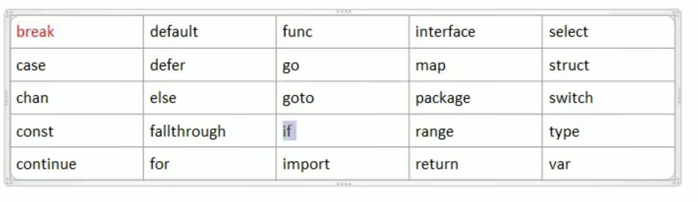

### 6.4 标识符命名注意事项

1. 包名： 保持 package 的名字与目录保持一致，尽量采取有意义的包名，简短，有意义，不要和标准库起冲突
2. 变量名，函数名，常量名采用驼峰法
3. 如果变量名、函数名、常量名首字母大写，则可以被其他的包访问，如果首字母小写，则只能在本包中使用（首字母大写是公有的，首字母小写是私有的）

### 6.5 预定标识符

除了保留关键字外，Go 还提供了 **36** 个预定的标识符，**其包括基础数据类型和系统内嵌函数**

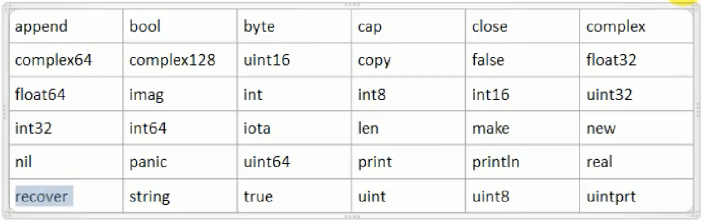

## 7 运算符介绍

运算符是一种特殊的符号，用以表示数据的**运算**、**赋值**和**比较**等

### 7.1 算数运算符

算数运算符是对数值类型的变量进行运算的，如下：

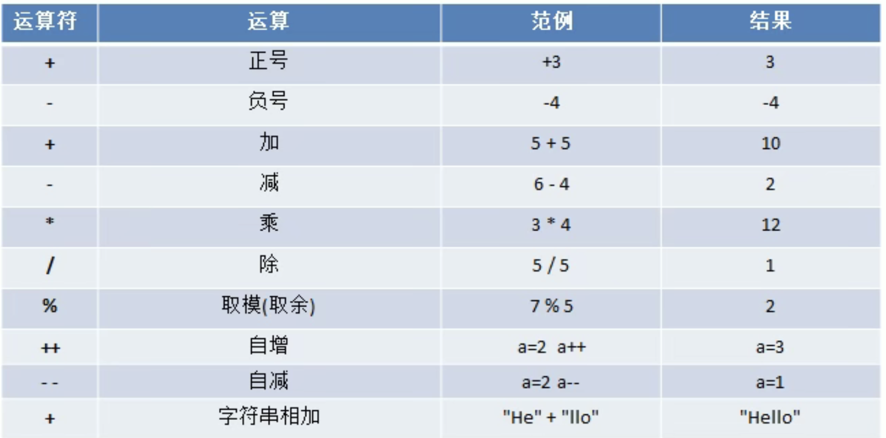

``` go
// / 和 % 例子
// 如果运算的数都是整数，那么除后，会去掉小数部分，保留整数部分
fmt.Println(10 / 4)
var n1 float32 = 10 / 4 // 结果为 2
// 如果希望保留小数部分，则需要有浮点数参与运算
var n2 float32 = 10.0 / 4

// % 的使用
// 公式 a % b = a - a / b * b
fmt.Println(10 % 3) // 1
fmt.Println(-10 % 3) // -1
fmt.Println(10 % -3) // -1
fmt.Println(-10 % -3) // 1
```

**细节说明**

1. 对于除号 “/”, 它的整数除和小数除是有区别的，整数之间做除法时，只保留整数部分而舍弃小数部分
2. 当对于一个数**取模时，可以等价 a % b = a - a / b * b**
3. Golang的自增自减**只能独立使用**，**不能**写成：b := a++ 或 b := a--
4. **Golang 的++ 和-- 只能写在变量的后面，不能写在变量的前面**

### 7.2 赋值运算符

1. 介绍
   1. 赋值运算符就是将某个运算后的值，赋给指定的变量
2. 赋值运算符的分类

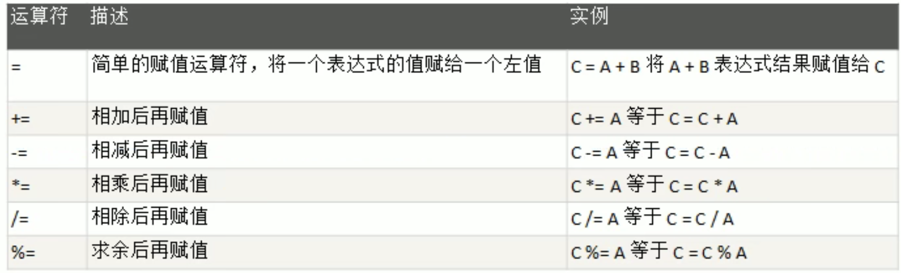

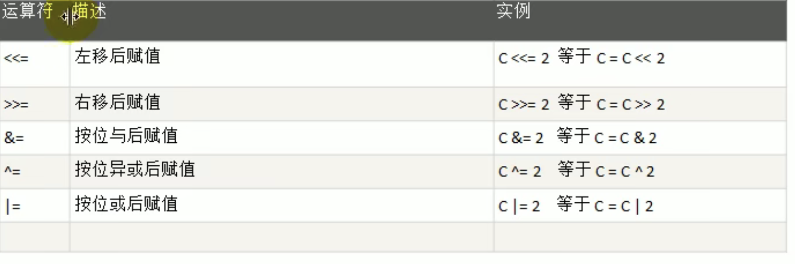

### 7.3 比较运算符/ 关系运算符

1. 介绍

   1. 关系运算符的结果都是 bool 型，要么为true，要么为 false
   2. 关系表达式经常用在 if 结构的条件中或循环结构的条件中

2. 一览

   

3. 运算符优先级

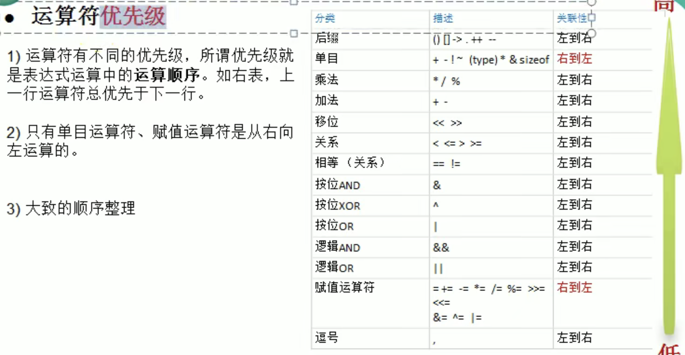

大致优先级如下：

1. 括号， ++ ， --
2. 单目运算
3. 算数运算符
4. 移位运算
5. 关系运算符
6. 位运算
7. 逻辑运算符
8. 赋值运算符
9. 逗号

### 7.4 逻辑运算符

与 &&（短路与）

或 || （短路或）

非 ！

### 7.5 位运算符

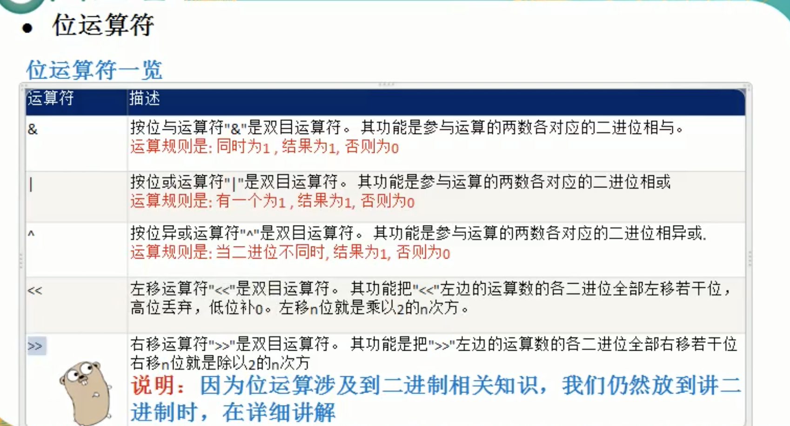

### 7.6 其他运算符

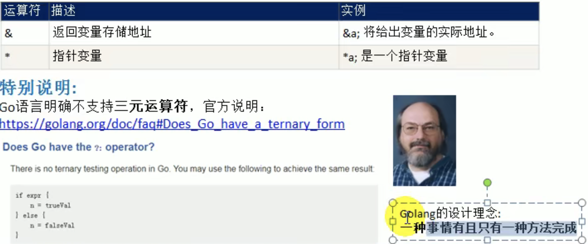

键盘输入语句

``` go
// 步骤
// 导入 fmt 包， 调用 fmt.Scanln() 或 fmt.Scanf()
```

## 8 程序流程控制

### 8.1 介绍

在程序中，程序运行的流程控制决定程序是如何执行的，是我们必须掌握的，主要有三大流程控制语句

1. 顺序控制
2. 分支控制
3. 循环控制

### 8.2 顺序控制

程序从上到下逐行地执行，中间没有任何判断和跳转

### 8.3 分支控制

#### 8.3.1 分支控制 if-else 介绍

让程序有选择的执行，分支控制有三种：

1. 单分支
2. 双分支
3. 多分支

特殊 例子

``` go
// if 语句中可以定义变量
if age := 20; age > 18 {
  fmt.Println("已成年")
} else if age > 18 {
  fmt.Println("未成年")
} else {
  fmt.Println("刚 18 岁")
}
// 注意以下写法错误
var b bool = true
if b = false { // 编译错误，不允许把赋值语句放在 if 的条件表达式内
  
}
```

#### 8.3.2 switch分支结构

基本介绍

1. switch 语句用于基于不同条件执行不同动作，每一个 case 分支都是唯一的，从上到下逐一测试，直到匹配为止
2. 匹配项后面也**不需要再加 break**

基本语法

``` go
switch 表达式 {
 case 表达式 1， 表达式 2, ... :
   语句块 1
  case 表达式 3，表达式 4，... :
    语句块 2
  // 这里可以有多个 case 语句
  default:
   语句块
}
```

Switch细节讨论

1. case后是一个表达式（即：**常量值、变量、一个有返回值的函数**等都可以）
2. case后的各个表达式的值的数据结构，必须和 switch 的表达式数据类型一致
3. case后面可以带多个表达式，使用逗号间隔，比如 case 表达式 1，case 表达式 2
4. case 后面的表达式如果是常量值（字面量），则要求不能重复
5. case 后面不需要带 break，程序匹配到一个 case 后就会执行对应的代码块，然后退出switch，如果一个都匹配不到，则执行 default
6. default 语句不是必须的

``` go
// 例
// 7. case 中也可以对范围进行判断
 switch {
 case n_ > 2:
 case n_ > 3, n_ > 4:
 case n_ > 2:
 }

 
 switch n_ {
 case 1:
 case 2:
 case 3:
  fmt.Println("switch")
 default:
  fmt.Println("123")
 }
// 8. switch 后也可以直接声明/定义一个变量，分号结束，不推荐
switch n := 33; {
 case 1:
 case 2:
 case 3:
  fmt.Println("switch")
}

// 9. switch 的穿透 fallthrought
 var num int = 10
 switch num {
 case 10:
  fmt.Println("ok1")
  fallthrough //默认只能穿透一层
 case 20:
  fmt.Println("ok2")
 case 30:
  fmt.Println("ok3")
 default:
  fmt.Println("没有匹配到")
 }
// 10. Type Switch: switch语句还可以被用于 type-switch 来判断某个 interface 变量中实际指向的变量类型
var x interface{}
 var y = 10.0
 x = y
 // x.(type) 获取 x 的数据类型
 switch x.(type) {
 case nil:
  fmt.Println("空")
 case float64:
  fmt.Println("float64")
 }
```

### 8.4 循环控制

可以让代码可以循环的执行

``` go
// 基本语法
for 循环变量初始化; 循环条件； 循环变量迭代 {
  循环操作（语句）
}

// 例 1 第一种写法
for i := 1; i <= 10; i++ {
  fmt.Println(i)
}

// 例二 第二种写法
j := 1
for j <= 10 {
  fmt.Println(j)
  j++
}

// 例三 第三种写法
for {
  // 魂环执行语句
}
//等价于如下语句， 是一个无限循环，通常需要配合 break 语句使用。
for ;; {} 

// 字符串遍历方式 1 - 传统方式（如果字符串中含有中文会出现错误，出现乱码
 var string string = "hello world"
 for z := 0; z < len(string); z++ {
  fmt.Printf("%c", string[z])
 }

// 原因是对字符串的遍历是按照字节来遍历的，而一个汉字在 utf8 编码是对应 3 个字节
// 如何解决 需要将 str 转成[] rune 切片(后面介绍)
 str3 := []rune(string) // 将 str 转成[] rune
 for z := 0; z < len(str3); z++ {
  fmt.Printf("%c", str3[z])
 }

// 字符串遍历方式 2- for-range 方式
for index, val := range string {
  fmt.Printf("index: %d, val: %c\n", index, val)
 }

// golang中没有 while 和 dowhile，可以用 for+if 代替
// while 
for {
  if 表达式 {
    break
  }
  循环语句
}

// do...while
for {
  循环语句
  if 表达式 {
    break
  }
}

```

练习代码

``` go
package main

import (
 "fmt"
)

func main() {
 fmt.Println("请输入打印金字塔的层数：")
 var n int
 fmt.Scanln(&n)

 for i := 0; i < n; i++ {
  // 打印之前的空格
  for s := 0; s < n-i; s++ {
   fmt.Printf(" ")
  }

  for x := 0; x < 2*i+1; x++ {
   if i == n-1 {
    fmt.Printf("*")
   } else {
    if x == 0 || x == 2*i {
     fmt.Printf("*")
    } else {
     fmt.Printf(" ")
    }
   }
  }
  fmt.Println()
 }
}


func main2() {
  fmt.Println("九九乘法表如下：")
 n := 9
 i := 1
 x := 1
 for {
  if x > n {
   break
  }
  fmt.Printf("%dx%d=%d ", i, x, i*x)
  if i == x {
   i = 0
   x++
   fmt.Println()
  }
  i++
 }
  
  fmt.Printf("100 ~ 999的水仙花数如下：\n")

 for x := 100; x <= 999; x++ {
  n1 := x / 100
  n2 := x / 10 % 10
  n3 := x % 10
  if n1*n1*n1+n2*n2*n2+n3*n3*n3 == x {
   fmt.Println(x)
  }
 }
}

```

随机数的使用

``` go
// time.Now().Unix() 返回一个从 1970:01:01的 0 时 0 分 0 秒到现在的秒数
 rand.Seed(time.Now().Unix())
 // rand.Intn(100) 的随机值范围为 [0, 100)
 rand := rand.Intn(100) + 1
```

### 8.5 跳转控制

#### 8.5.1 break

#### 8.5.2 continue

#### 8.5.3 goto

1. Go语言的 goto 语句可以无条件地转移到程序中指定的行
2. goto语句通常与条件语句配合使用， 可用来实现条件转移，跳出循环体等功能。
3. 在 Go 程序设计中**一般不主张使用 goto 语句**，以免造成程序流程的混乱，使理解和调试程序都产生困难

基本语法：

``` go
goto label
label: statement
```

#### 8.5.4 return

return 使用在方法或者函数中，表示跳出所在的函数或方法。

## 9 函数和方法

### 9.1 解决方法-函数

为完成某一功能的程序指令（语句）的集合，**称为函数**

在 Go 中，函数分为：**自定义函数**、**系统函数**（查看 Go 编程手册）

#### 9.1.1 函数的定义

基本语法

``` go
func 函数名（形参列表）（返回值类型列表） {
  执行语句
  return 返回值列表
}
```

1. 形参列表：表示函数的输入
2. 函数中的语句：表示为了实现某一功能代码块
3. 函数可以有返回值，也可以没有

#### 9.1.2 包的介绍

包的**本质实际上就是创建不同的文件夹**，来存放程序文件

说明：go 的每一个文件都是属于一个包的，也就是说go 是以包的形式来管理文件和项目目录结构

1. 区分相同名字的函数、变量等标识符
2. 当程序文件很多时，可以很好的管理项目
3. 控制函数、变量等访问范围、即作用域

``` go
// 打包基本语法
package util
// 引入包的基本语法
import "包的路径" // 包的路径从 src 开始
```

#### 9.1.3 包的注意事项和细节说明

1. 在给一个文件打包时，该包对应一个文件夹，比如这里的 utils 文件夹对应的包名就是 utils，文件的包名通常和文件所在的文件夹名一致，一般为小写字母。

2. 当一个文件要使用其他包函数或变量时，需要先引入对应的包

   ``` go
   //引入方式 1：
   import "包名"
   
   //引入方式 2：
   import (
    "包名"
     "包名"
   )
   ```

3. package 指令在文件第一行，然后是 import 指令。

4. 在 import 包时，路径从$GOPATH的 src 下开始，不用带 src，编译器会自动从 src 下开始引入

   1. 为了让其他包的文件可以访问到本包的函数，**则该函数名的首字母需要大写**，类似其他语言的 public，这样才能跨包访问。

   2. 编译后生成一个有默认名的可执行文件，在$GOPATH目录下可以指定名字和目录，比如：放在 bin 目录下

      ```bash
      go build -o bin/exe /go_code/project/main
      ```

5. 在访问其他包函数、变量时，其语法是包名.函数名
6. 如果包名较长，Go 支持给包取别名，注意细节，**取别名后，原来的包名就不能使用了，需要使用别名来访问和使用**
7. 在同一包下，不能有相同的函数名（也不能有相同的全局变量名），否则报重复定义
8. 如果要编译一个可执行程序文件，就需要将指责格包声明为 main，即 package main，这个就是一个语法规范，如果你是写一个库，包名可以自定义。

#### 9.1.4 函数-调用机制

程序员调用方法，然后方法返回结果

return 语句

基本语法

Go 函数支持返回多个值

```go
func 函数名（形参列表）（返回值类型列表） {
 语句..
  return 返回值列表
}
```

递归调用

一个函数在函数体内又调用了本身，我们称为递归调用

函数递归需要遵守的重要原则：

1. 执行一个函数时，就创建一个新的受保护的独立空间（新函数栈）
2. 函数的局部变量是独立的。不会相互影响
3. 递归必须向退出递归的条件逼近，否则就是无限递归
4. 当一个函数执行完毕，或者遇到 return，就会返回，遵守谁调用就会将结果返回给谁，同时当函数执行完毕或返回时，该函数本身也会被系统销毁

#### 9.1.5 函数调用的机制的底层分析

1. 栈区（基本数据类型，一般说分配到栈区，编译器存在一个逃逸分析）
2. 堆区（引用数据类型一般分配到堆区，编译器存在一个逃逸分析）
3. 代码区（代码存放到这）

#### 9.1.6 函数注意事项和细节讨论

1. **基本数据类型**和**数组**默认都是**值传递**的，即进行值拷贝，在函数内修改，不会影响到原来的值

2. 如果希望**函数内的变量能修改函数外的变量**，可以传入变量的地址**&**，函数内以指针的方式操作变量

   ``` go
   func test(n1 *int) {
    *n1 = *n1 + 10
    fmt.Println(*n1) // 133
   }
   n1 := 123
   test(&n1)
   fmt.Println(n1) // 133
   ```

3. Go 函数不支持重载

4. 在 Go 中，**函数也是一种数据类型**，可以赋值给一个变量，则该变量就是一个函数类型的变量了，通过该变量可以对函数调用

5. 函数既然是一种数据类型，因此在 Go 中，函数可以作为形参，并且调用！

   ``` go
   func getSum(n1 int, n2 int) int {
     return n1 + n2
   }
   func main() {
     a := getSum
     fmt.Printf("a的数据类型 %T, getSum类型是%T",a, getSum)
     res := a(10, 20) // 等价 res := getSum(10, 20)
     fmt.Println("res = ", res)
   }
   ```

6. 为了简化数据类型定义，Go 支持自定义数据类型

   ``` go
   // 基本语法
   type 自定义数据类型名 数据类型 // 理解：相当于一个别名
   // 案例
   type myInt int // 这时 myInt就等价 int 来使用了。
   type mySum func(int, int) int //这时 mySum 就等价一个函数类型 func(int,int) int
   ```

7. 支持对函数返回值命名

   ``` go
   func cal(n1 int, n2 int) (sum int, sub int) {
     sum = n1 + n2
     sub = n1 - n2
     return
   }
   ```

8. 使用`_`标识符，忽略返回值

9. Go支持可变参数

   ``` go
   // args是 slice 切片，通过 args[index] 可以访问到各个值
   func sum(args... int) sum int {
   }
   // 如果一个函数的形参列表中有可变参数，则可变参数需要放在形参列表最后
   func sum(n1 int, args... int) sum int {
   }
   ```

### 9.2 init 函数

每个源文件都可以包含一个 init 函数， 该函数会在 main 函数执行前，被 Go 运行框架调用，也就是说 init 会在 main 函数前被调用。

``` go
// init 函数， 通常可以在 init 函数中完成初始化工作

var a = test() // first

func test() {
  fmt.Println("test()")  // first
}

func init() {
  fmt.Println("init()...") // second
}
func main() {
  fmt.Println("main()...") // third
}
```

#### 9.2.1 init 函数的注意细节

1. 如果一个文件同时包含全局变量定义，init函数和 main 函数，则**执行的流程是变量定义->init函数->main函数**
2. init 函数最主要的作用，就是完成一些初始化的工作

### 9.3 匿名函数

Go 支持匿名函数，匿名函数就是没有名字的函数。如果我们某个函数只是希望使用一次，可以考虑使用匿名函数，匿名函数也可以实现多次调用。

使用方式

- 在定义匿名函数时就直接调用

  ``` go
  res1 := func (n1 int, n2 int) int {
    return n1+n2
  }(10, 20)
  fmt.Println("res1=", res1) // 10 + 20 = 30
  ```

- 将匿名函数赋给一个变量（函数变量），再通过该变量来调用匿名函数

  ``` go
  // 将匿名函数 func (n1 int, n2 int) int 赋给a 变量
  // 则 a的数据类型就是函数类型，此时，我们可以通过 a 完成调用
  a := func(n1 int, n2 int) int {
    return n1 - n2
  }
  res2 := a(10, 30)
  ```

- 全局匿名函数（如果将匿名函数赋给全局变量，那么这个匿名函数就成为一个全局匿名函数，可以在程序中有效。

  ``` go
  var (
    // fun1就是一个全局匿名函数(若想在任何地方使用，则首字母必须大写)
    Fun1 = func (n1 int, n2 int) int {
      return n1 * n2
    }
  )
  ```

### 9.4 闭包

  闭包就是**一个函数**和与**其相关的引用环境**组成的一个整体（实体）

``` go
// 累加器
func AddUpper() func (int) int {
  // 此处是一个闭包
  // 返回的是一个匿名函数，但是这个匿名函数引用到函数外的 n，因此这个匿名函数就和 n 形成一个整体，构成闭包
  var n int = 10
  return func (x int) int {
    n = n + x
    return n
  }
}
func main() {
  // 使用前面的代码
  f := AddUpper()
  fmt.Println(f(1)) // 11 
  fmt.Println(f(2)) // 13
  fmt.Println(f(3)) // 16
}
```

对上面代码的说明和总结

1. AddUpper是一个函数， 返回的数据类型是 func(int) int
2. 闭包类似一个类，而函数时操作，n 是字段，函数和它使用到 n 构成闭包
3. 当我们反复的调用 f 函数时，因为 n 是初始化一次，因此每调用一次就进行累计
4. 闭包的关键，分析出返回的函数它使用（引用）到哪些变量，因为函数和它引用到的变量共同构成闭包

闭包实践

``` go
// 添加文件后缀，若不符合的话
func makeSuffix(suffix string) func(string) string {
 return func(filename string) string {
  if strings.HasSuffix(filename, suffix) {
   return filename
  }
  return filename + suffix
 }
}

func main() {
  f1 := makeSuffix(".jpg")
 fmt.Println("处理后的文件名:", f1("winer"))
}
```

闭包的好处

- 复用代码
- 可以以规则创建一个闭包，然后使用闭包处理相同规则的数据

### 9.4 函数中-defer

为什么需要 defer

在函数中，程序员经常需要创建资源（比如：数据库连接、文件句柄、锁等），为了在函数执行完毕后，及时的释放资源，Go 的设计者提供 defer（延时机制）。

``` go
func sum(n1 int, n2 int) int {
  // 当执行到 defer时，暂时不执行，会将 defer 后面的语句压入到独立的栈（defer栈）
 // 当函数执行完毕后， 再从 defer 栈，按先入后出的方式执行
  defer fmt.Println("ok1, n1=", n1)// 3 n1 = 10
  defer fmt.Println("ok2, n2=", n2) // 2 n2=20
  n1++
  n2++
  res := n1 + n2 // res = 32
  fmt.Println("ok3") // 1
  return res
}
func main() {
  res := sum(10, 20)
  fmt.Println("res=", res) // 4 res = 32
}
```

注意： 在 defer 将语句放入栈中，也会将相关的值拷贝同时入栈

defer 的最佳实践：当函数执行完毕后，可以及时的释放函数创建的资源

``` go
func test {
  // 关闭文件资源
  file = openfile(文件名)
  defer file.close()
}
```

说明

1. 在 golang 编程中的通常做法是，创建资源后，比如（打开了文件，获取数据库的链接，或者是锁资源，可以执行 defer file.Close()
2. 在 defer 后，可以继续使用创建资源
3. 当函数完毕后，系统会依次从 defer 栈中，取出语句，关闭资源
4. 这种机制，非常简洁，程序员不用再为什么时机关闭资源而烦心

### 9.5 函数参数的传递方式

值类型参数默认就是值传递，而引用类型参数默认就是引用传递

两种传递方式

- 值传递
- 引用传递

不管是值传递还是引用传递，传递给函数的都是变量的副本，不同的是，值传递就是值的拷贝，引用传递的是地址的拷贝，一般来说，地址拷贝效率高，因为数据量小，而值拷贝决定拷贝的数据大小，数据越大，效率越低

### 9.6 变量作用域

说明

1. 函数内部声明/定义的变量叫**局部变量，作用域仅限于函数内部**
2. **函数外部声明/定义的变量叫全局变量，作用域在整个包内都有效，如果其首字母为大写，则作用域在整个程序有效**
3. 如果变量是在一个代码块，比如 for/if中，那么这个变量的作用域就在该代码块内t

**注意：**

``` go
Name:= "123"// 报错
// 因为上述语句可分为如下两步
// var Name string
// Name = "123"  注意，这条语句是操作语句，只能在函数体内使用(赋值语句不能在函数体外)
func main() {
  fmt.Println("name", Name)
}
```

### 9.7 字符串中常用的函数

1. 统计字符串的长度， 按字节 len(str)

2. 字符串遍历，同事处理有中文的问题

    ``` go
     r:= []rune(str)
    ```

3. 字符串转整数

   ``` go
   n, err := strconv.Atoi("12")
   ```

4. 整数转字符串

   ``` go
   str = strconv.Itoa(12345)
   ```

5. 字符串转[]byte

   ``` go
   var bytes = []byte("hello go")
   ```

6. []byte转字符串

   ``` go
   str = string([]byte(97,98,99))
   ```

7. 10进制转 2，8，16 进制

   ``` go
   str = strconv.FormatInt(123, 2) // 2 -> 8, 16
   ```

8. 查找子串是否在指定的字符串中

   ``` go
   strings.Contains("seafood","foo") // true
   ```

9. 统计一个字符串有几个指定的子串

   ``` go
   strings.Count("ceheese","e") // 4
   ```

10. 不区分大小写的字符串比较**(==是区分字母大小写的)**

    ``` go
    fmt.Println(strings.equalFold("abc","Abc")) // true
    ```

11. 返回子串在字符串第一次出现的 index 值， 如果没有返回-1

    ``` go
    strings.index("NLT_abc","abc") // 4
    ```

12. 返回子串在字符串中最后一次出现的 index 值，如果没有返回-1

    ``` go
    strings.LastIndex("aaaa", "a")
    ```

13. 将指定的子串替换成另一个子串

    ``` go
    // n 可以指定你希望替换几个，如果 n = -1 表示全部替换
    strings.Replace("go go hello", "go", " come", n)
    ```

14. 按照指定的某个字符为分隔标识，将一个字符串拆分成字符串数组

    ``` go
    strArr := strings.Split("hello  ,sss", ",")
    ```

15. 将字符串的字母进行大小写的转换

    ``` go
    strings.ToLower("Go") // go
    strings.ToUpper("GO") // GO
    ```

16. 将字符串左右两边的空格去掉

    ```go
    strings.TrimSpace("  tn a lone go")
    ```

17. 将字符串左右两边指定的字符去掉

    ``` go
    // 将左右两边"!" 和" "去掉
    strings.Trim("!hello! ", " !")
    ```

18. 将字符串左边指定的字符去掉

    ``` go
    strings.TrimLeft("! hello", " !")
    ```

19. 将字符串右边指定的字符去掉

    ``` go
    strings.TrimRright("! hello  !", "  !")
    ```

20. 判断字符串是否以指定的字符串开头

    ``` go
    strings.HasPrefix("ftp://", "ftp")
    ```

21. 判断字符串是否以指定的字符串结束

    ``` go
    strings.HasSuffix("NLt_abc", "abc")
    ```

### 9.8 时间和日期相关函数

1. 时间和日期相关函数，需要导入 time 包

2. time.Time类型,用于表示事件

   ``` go
   now := time.Now()
   fmt.Printf("type = %T val = %v", now, now)
   ```

3. 获取当前时间的方法

   ``` go
   now := time.Now() // now的类型就是 time.Time
   ```

4. 格式化时间

   ``` go
   now := time.Now()
   fmt.Printf("当前年月日 %d-%d-%d %d:%d:%d \n",
              now.Year(),
              now.Month(),
              now.Day(),
              now.Hour(),
              now.Minute(),
              now.Second());
   dataStr := Sprintf("当前年月日 %d-%d-%d %d:%d:%d \n",
              now.Year(),
              now.Month(),
              now.Day(),
              now.Hour(),
              now.Minute(),
              now.Second());
   // 格式化日期事件的第二种方式
   // 固定写法，数字不能变，格式可以变
   fmt.Printf(now.Format("2006-01-02 15:04:05"))
   fmt.Println()
   fmt.Printf(now.Format("2006-01-02"))
   fmt.Println()
   fmt.Printf(now.Format("15:04:05"))
   fmt.Println()
   ```

   说明 **"2006/01/02 15:04:05" 这个字符串的各个数字是固定的，必须是这样写**

   **"2006/01/02 15:04:05"这个字符串各个数字可以自由的组合，这样可以按程序的需求返回时间和日期**

6. 时间的常量

   ``` go
   const (
    Nanosecond Duration = 1 // 纳秒
    MicroSecond = 1000 * Nanosecond // 微秒
     Millisecond = 1000 * MicroSecond // 毫秒
     Second = 1000 * Millisecond // 秒
     Minute = 60 * Second // 分钟
     Hour = 60 * Minute // 小时
   )
   // 常量的作用在程序中可用于获取指定时间单位的时间
   ```

   7. 休眠

      ``` go
      func Sleep(d duration) 
      time.Sleep(1000 * 10 * time.Millisecond)
      time.Sleep(10 * time.Second)
      ```

   8. 获取当前 unix 时间戳和 unixnano 时间戳（作用是可以获取随机数字）

      ``` go
      //unix // 时间戳 1970.1.1 年到现在的秒数
      now.Unix()
      //unixnano // 时间戳 1970.1.1 年到现在的纳秒数
      now.UnixNano()
      ```

### 9.9 内置函数

Golang设计者为了编程方便，提供了一些函数，这些函数可以直接使用，我们称为 Go 的内置函数

[文档](https://studygolang.com/pkgdoc) -> buildin

len: 用来求长度，比如 string、array、slice、map、channel

new：用来分配内存，主要用来分配值类型，比如 int,float32, struct ... 返回的是指针

``` go
num2 := new(int) // *int
// num2 的类型%T => *int
// num2的值 => 指向的地址
// num2的地址 => *int的地址
// num2指向的值 => 0
fmt.Printf("num2的类型%T, num2的值=%v, num2的地址%v, num2指向的值:%v", num2,num2,&num2, *num2)
```

make： 用来**分配内存**，只要用来**分配引用类型**，比如 chan，map，slice。

### 9.10 错误处理

看一段代码，引出错误处理

``` go
func test() {
  // 使用 defer + recover 来捕获和处理异常
  defer func() {
    err := recover() // recover() 内置函数，可以捕获到异常
    if err != nil { // 说明捕获到异常或者错误
      fmt.Println("err=", err)
      // 这里就可以将错误信息发送给管理员...
      fmt.Println("发送邮件给管理员")
    }
  }()
  num1 := 10
  num2 := 0
  res := num1 / num2 // 发生异常
  fmt.Println("res=",res)
}
func main() {
  // 测试
  test()
}
```

1. 在默认情况下，当发生错误后(panic), 程序就会退出（崩溃）
2. 如果我们希望，当发生错误后，可以捕获到错误，并进行处理，保证程序可以继续执行，还可以在捕获到错误后，给程序员一个提示（邮件、短信）
3. Go 语言追求简洁优雅，所以 Go 语言不支持传统的 try..catch..finally错误处理方式为：**defer，panic，recover**
4. **Go 中可以抛出一个 panic 的异常，然后在 defer 中通过 recover 捕获这个异常，然后正常处理**

**使用 defer + recover 处理出错误**(如上)

#### 9.10.1 **错误处理的好处**

进行错误处理后，程序不会轻易挂掉，如果加入预警代码，就可以让程序更加的健壮

#### 9.10.2 自定义错误

Go 程序中，也支持自定义错误，使用 errors.New和 panic 内置函数

``` go
//errors.New("错误说明") // 会返回一个 error 类型的值，表名一个错误
//panic // 内置函数，接收一个 interface{}类型的值（也就是任何值了）作为参数，可以接收 error类型的变量，输出错误信息，并推出程序
func readConf(name string)(err error) {
  if name == "config.ini" {
    // 读取
    return nil
  }else {
    // 返回一个自定义错误
    return errors.New("读取文件错误")
  }
}

func test02() {
  err := readConf("config.ini")
  if err != nil {
    // 如果读取文件发生错误，就输出这个错误，并终止程序
    panic(err)
  }
  fmt.Println("test02()继续执行。。。")
}
```

## 10 数组与切片

### 10.1 数组

#### 10.1.1 数组介绍

数组可以存放多个**同一类型数据**，数组也是一种数据类型，在 Go 中，**数组是值类型**

``` go
// 定义一个数组
var hens [6]float64;

```

#### 10.1.2 数组的定义和内存布局

数组的定义

``` go
var 数组名 [数组大小]数据类型
var a [5]int
// 赋初值
a[0] = 1
```

数组在内存的布局(重要)

``` go
var arr [3]int
// arr 的地址0xc000130000, arr[0]的地址0xc000130000, arr[1]的地址0xc000130008, 0xc000130010
fmt.Printf("arr 的地址%p, arr[0]的地址%p, arr[1]的地址%p, %p\n", &arr, &arr[0], &arr[1], &arr[2])
```

#### 10.1.3 数组的使用

1. 访问数组元素

``` go
数组名[下标]
```

``` go
// 四种初始化数组的方式
var arr [3]int = [3]int{1, 2, 3}

// 这里的 [...]可变长 是规定的写法
var arr1 = [...]int{8,9,10}
// 按指定索引赋值
var arr2 = [...]int{1: 800, 0:900, 2:999}

// 使用类型推导
arr3 := [...]string{1 : "tom", 0 : "jack"}
```

2. 数组的遍历

   - 常规遍历

   - for-range 结构遍历

     ``` go
     // 基本语法
     for index, value := range arr {
       ...
     }
     // 说明
     // 第一个返回值 index 是数组的下标
     // 第二个 value 是该下标位置的值
     // 它们都是仅在 for 循环内部可见的局部变量
     // 遍历数组元素的时候，如果不想使用下标 index，可以直接把下标 index 标为_
     // index和 value 的名称不是固定的，可以自行指定
     ```

#### 10.1.4 数组使用注意事项和细节

1. 数组是多个相同数据类型数据的组合，一个数组一旦声明/定义了，其长度是固定的，不能动态变化

   ``` go
   //若需要动态指定数组的长度则需要使用 make 来创建数组
   n := 2
   arr := make([]int, n)
   
   // 二维数组如下写法
   m := 2
   n := 3
   // 创建 arr[m][n]
   arr := make([][]int, m)
   for i,_ := range arr {
     arr[i] = make([]int, n)
   }
   ```

2. var arr []int 这时 arr就是一个 slice 切片

3. 数组中的元素可以是任何数据类型，包括值类型和引用类型，但不能混用

4. 数组创建后，如果没有赋值，则为默认值

5. 使用数组的步骤

   1. 声明数组并开辟空间
   2. 给数组各个元素赋值
   3. 使用数组

6. 数组的下标是从 0 开始的

7. 数组下标必须在指定范围内使用，否则报 panic，数组越界

   1. 如：var arr [5]int 则有效下标为 0-4

8. Go 的数组属值类型，在默认情况下是值传递，因此会进行值拷贝。数组间不会相互影响

9. 如想在其他函数中，去修改原来的数组，可以使用引用传递（指针方式）

10. **长度是数组类型的一部分，在传递函数参数时，需要考虑数组的长度**

    ``` go
    // 值 copy
    func modify(arr []int) {
      arr[0] = 100
    }
    
    func modify1(arr [4]int) {
      
    }
    
    func modify2(arr [3]int) {
      
    }
    
    func main() {
      var arr = [...]int{1,2,3}
      modify(arr) // 编译错误 不能将[3]int 传递给[]int
      modify1(arr) // 编译错误 不能将[3]int 传递给[4]int
      modify2(arr) // 正确
    }
    ```

#### 10.1.5 数组应用案例

1. 创建一个 byte 类型的 26 个元素的数组，分别放置'A' - 'Z', 使用 for 循环访问所有元素并打印出来
2. 请求出一个数组的最大值，并得到对应的下标
3. 请求出一个数组的和和**平均值**。for-range
4. 随机生成 5 个数，并将其反转打印

#### 10.1.6 二维数组

``` go
// 使用方式：先声明/定义再赋值
// 语法
var 数组名 [n][n]类型 // 定义
// 直接初始化
// 声明
var 数组名 [n][n]类型 = [n][n]类型{{初值},{初值}}
赋值（有默认值，比如 int 类型的就是 0
// 二维数组声明/定义时的四种写法
var 数组名 [n][n] = [n][n]类型{{初值},{初值}}
var 数组名 [n][n] = [...][n]类型{{初值},{初值}}
var 数组名 = [n][n]类型{{初值},{初值}}
var 数组名 = [...][n]类型{{初值},{初值}}
```

二维数组动态创建

``` go
 // 首先make第一维的大小
   var res = make([][]int, n)
// 然后分别对其中的进行make
   for i := range res{
   res[i] = make([]int, n)
 }
```

二维数组的遍历

- 双层 for 循环完成遍历

  ``` go
  var arr3 = [2][3]int{{1,2,3},{4,5,6}}
  
  for i := 0; i < len(arr3); i++ {
    for j:= 0; j < len(arr3[i]); j++ {
      fmt.Printf("%v\t", arr3[i][j])
    }
  }
  ```

- for-range 方式完成遍历

  ``` go
  var arr3 = [2][3]int{{1,2,3},{4,5,6}}
  for i, val := range arr3 {
    for j, v2 : range v {
      fmt.Printf("arr3[%v][%v] = %v", i, j, v2)
    }
  }
  ```

### 10.2 切片

#### 10.2.1 介绍

1. 切片的英文是 slice

2. 切片是数组的一个引用，因此切片是引用类型，在进行传递时，遵守引用传递的机制

3. 切片的**使用和数组类似**，遍历切片，访问切片的元素和求和切片长度 len（slice）都一样

4. 切片的长度是可以变化的，因此切片是一个可以**动态变化数组**

5. 切片定义的基本语法

   ```go
   var 变量名 []类型
   // 比如 
   var a []int
   ```

``` go
// 演示
var intArr [5]int = [...]int {1,22,33,66,99}
// 声明/定义一个切片
// slice := intArr[1:3]
// 1. slice就是切片名
// 2. intArr[1:3] 表示 slice 引用到 intArr 这个数组的[1,3)数据,起始下标为 1，最后的下标 为3（但不包含 3）
slice := intArr[1:3]
fmt.Println("intArr=",intArr)
fmt.Println("slice 的元素是=", slice) // 22, 33
fmt.Println("slice的元素个数=", len(slice))  // 2
fmt.Println("slice的容量=", cap(slice)) // 切片的容量是可以动态变化,容量变化策略（待查）

```

#### 10.2.2 切片在内存中的布局

1. slice 的确是一个引用类型
2. slice 从底层来说，其实就是一个数据结构（struct 结构体）

``` go
type slice struct {
  ptr *[2]int // 指针类型随目标数据类型
  len int
  capability int
}
```

#### 10.2.3 切片的使用

1. 定义一个切片，然后让切片去引用一个已经创建好的数组

   ``` go
   arr := [...]int{1,2,3}
   slice := arr[1:3]
   ```

2. 通过 make 来创建切片（make 也会创建一个数组）

   ``` go
   // 基本语法
   var 切片名 []type=make([], len, [cap])
   // type 就是数据类型，len:大小，cap:指定切片容量（cap必须>=len）（可选）
   ```

3. 定义一个切片，直接就指定具体数组，使用原理类似 make 的方式

   ``` go
   var slice []string = []string{"tom", "jack"}
   ```

小结：

1. 通过 make 方式创建切片可以指定切片的大小和容量
2. 如果没有给切片的各个元素赋值，那么就会使用默认值[int, float => 0, string => "", bool => false]
3. 通过 make 方式创建的切片对应的数组是由 make 底层维护，对外不可见，即只能通过 slice 去访问各个元素

#### 10.2.3 切片的遍历

与数组的遍历方式相同，有两种遍历方式

- 常规 for
- for-range

#### 10.2.4 切片注意事项和细节说明

1. 基于数组创建切片

   ``` go
   var slice = arr[startIndex: endIndex]
   // 从 arr 数组下标为 startIndex，取到下标为 endIndex的元素
   // 注意：不包含 arr[endIndex]
   ```

2. 切片初始化时，仍然不能越界，范围在[0, len(arr))之间，但可以动态增长

   ``` go
   //第一种
   var slice = arr[0: end]
   // 可以简写如下
   var slice = arr[:end]
   // 第二种
   var slice = arr[start:len(arr)]
   //可以简写如下：
   var slice = arr[start:]
   //第三种
   var slice = arr[0:len(arr)]
   // 可以简写如下
   var slice = arr[:]
   
   ```

3. cap 是一个内置函数，用于统计切片的容量，即最大可以存放多少个元素。

4. 切片定义完后，还不能使用，因为本身是空的，需要让其引用到一个数组或 make 一个空间供切片来使用

5. 切片可以继续切片

6. 用 append 内置函数，可以对切片进行动态追加

   1. 切片 append 操作的底层原理分析

      1. 切片 append 操作的本质就是对数组扩容

         ``` go
         var slice3 []int = []int {100, 200, 300}
         // 通过 append 直接给 slice3 追加具体元素
         slice3 = append(slice3, 400, 500, 600)
         // 通过 append 将切片 slice3 追加给 slice3
         slice3 = append(slice3, slice3...)
         ```

      2. go 底层会创建一个新的数组 newArr(安装扩容后大小)

      3. 将 slice 原来包含的元素拷贝到新的数组newArr

      4. slice从新引用到 newArr

      5. 注意 newArr 是在底层来维护的，程序员不可见

      6. 切片的拷贝操作

         ``` go
         // 切片使用 copy 内置函数完成 copy
         var a []int = []int{1,2,3,4,5}
         var slice = make([]int, 10)
         // copy(param1, param2),param1和 param都是切片类型
         copy(slice, a)
         
         ```

         注意：如下代码是正确的

         ``` go
         var a []int = []int{1,2,3,4,5}
         var slice = make([]int, 1)
         fmt.Println(slice) // [0]
         copy(slice, a) // 正常 copy
         fmt.Println(slice) // [1]
         ```

#### 10.2.5 string 和 slice

1. string 底层是一个 byte 数组，因此 string 也可以进行切片处理

``` go
str := "hello world"
slice := str[6:]
fmt.println("slice=",slice) // " world"
```

2. string 是不可变的，也就是说不能通过 str[0] = 'z'方式来修改字符串
3. 如果需要修改字符串，可以先将 string -> []byte 或者[]rune -> 修改 -> 重写转成 string

``` go
// 修改字符串中的英文或者数字，但不能处理中文
// 原因是 []byte以1字节单位来处理，而一个汉字占 3 个字节，因此就会出现乱码
str := "hello world"
arr1 := []byte(str)
arr1[0] = 'z'
str = string(arr1)
fmt.Println("str=",str)

// 处理中文，解决方法是将 string 转成[]rune即可，因为[]rune按字符处理，兼容汉字
str := "hello world"
arr1 := []rune(str)
arr1[0] = 'z'
str = string(arr1)
fmt.Println("str=",str)


```

#### 10.2.6 切片2的练习

说明：编写一个函数 fbn(n int),要求完成

1. 可以接收一个 n int
2. 能够将斐波那契数列放到切片中

``` go
func fbn(n int) []int {
 fbnSlice := make([]int, n)
 fbnSlice[0] = 1
 fbnSlice[1] = 1
 for i := 2; i < n; i++ {
  fbnSlice[i] = fbnSlice[i-1] + fbnSlice[i-2]
 }
 return fbnSlice
}
```

## 11 排序和查找

### 11.1 排序介绍

排序是将一组数据，依指定的顺序进行排列的过程

排序的分类：

1. 内部排序

   指将需要处理的所有数据都加载到内部存储器中进行排序。

   包括（**交换式排序法、选择式排序法和插入式排序法**）。

   1. 交换排序法
      1. 冒泡排序
      2. 快速排序

2. 外部排序法

   数据量过大，无法全部加载到内存中，需要借助外部存储进行排序。

   包括（**合并排序和直接合并排序法**）。

### 11.2 查找介绍

1. 顺序查找
2. 二分查找（该数组是有序）

## 12 Go语言核心编程-map

### 12.1 map 介绍

map 是 key-value 数据结构，又称为字段或者关联数组。类似其他编程语言的集合，在编程中是经常使用到。

### 12.2 map 的声明

1. 基本语法

   ``` go
      var map变量名 map[keytype]valuetype
   ```

2. key可以是什么类型
   golang 中的 map 的 key 可以是很多种类型，比如 bool、数字、string、指针、channel、还可以是只包含前面几个类型的接口、结构体、数组

   通常为 **int， string**

   注意：slice,map还有 function 不可以，因为这几个没法用 == 来判断

3. map 声明举例

   ``` go
   var a map[string]string
   var a map[string]int
   var a map[int]string
   var a map[string]map[string]string
   ```

   注意：声明是不会分配内存的，初始化需要 make，分配内存后才能赋值和使用
4. 案例

   ``` go
   // map的声明
   var a map[string]string
   // 在使用map 前，需要先 make，make 的作用就是给 map 分配数据空间
   a = make(map[string]string, 10)
   a["no1"] = "王二狗" //
   fmt.Println(a)
   ```

5. 说明
   1. map 在使用前一定要 make
   2. map 的 key 是不能重复，如果重复了，则以最后这个 key-value 为准
   3. map 的 value 是可以相同的
   4. map 的 key-value 是无序的
   5. make 内置函数的说明

### 12.3 map 的使用方式

方式 1

``` go
// 声明，这时 map=nil
var cities map[string]string
// 分配空间
cities = make(map[string]string, 10)
```

方式 2

``` go
// 声明，就直接 make
var cities = make(map[string]string)
```

方式 3

``` go
// 声明 直接赋值
var cities map[string]string = map[string]string{
  "no4":"成都"
}
cities["no1"] = "北京"
```

### 12.4 map 的增删改查

``` go
var cities = map[string]string{}
// 如果 key 还没有，就是增加，如果 key 存在就是修改
map["key"]=value
// 删除(若 delete 指定的 key 不存在时，删除不会操作，也不会报错)
delete(cities, "key")
// 查找
val,found = map("key")

// map遍历
for k,v := range cities {
  fmt.Printf("k=%v, v=%v\n", k, v)
}
```

注意：

1. 如果我们要删除 map 的所有 key，可以遍历一下 key，逐个删除
2. 或者 map = make(),make一个新的，让原来的变成一个垃圾，gc 回收

### 12.5 map 的切片

基本介绍

切片的数据类型如果是 map，则我们称为 slice of map，这样使用 map 个数就可以动态变化

案例

要求：使用一个 map 来记录 monster 的信息，name 和 age，也就是说一个 monster 对应一个map，并且妖怪的个数可以动态的增加=》map 切片

``` go
import (
 "fmt"
)
func main() {
  // 1. 声明一个 map 切片
  // 准备放入两个妖怪
  monsters := make([]map[string]string, 2)
  // 2. 增加第一个妖怪的信息
  if monsters[0] == nil {
    monsters[0] = make(map[string]string,2)
    monsters[0]["name"] = "牛魔王"
    monsters[0]["age"]  = 500
  }
  if monsters[1] == nil {
    monsters[1] = make(map[string]string,2)
    monsters[1]["name"] = "牛魔王1"
    monsters[1]["age"]  = 500
  }
// 下面这个写法越界
//  if monsters[2] == nil {
//   monsters[2] = make(map[string]string,2)
//    monsters[2]["name"] = "牛魔王2"
//    monsters[2]["age"]  = 500
//  }
  
  // 1. 先定义个 monster 信息
  newMonster := map[string]string {
    "name": "新的妖怪",
    "age" : 200,
  }
  // 使用追加数据的方式
  monsters = append(monsters, newMonster)
  
  fmt.Println(monsters)
}
```

### 12.6 map 的排序

基本介绍

1. golang中没有一个专门的方法针对 map 的 key 进行排序
2. golang 中的 map 默认是无序的，也不是按照添加的顺序存放的
3. golang 中map 的排序，是先将 key 进行排序，然后根据 key 值遍历输出即可

案例演示

``` go
map1 := make(map[int]int, 10)
map1[10] = 100
map1[1] = 13
map1[4] = 56
map1[8] = 90
// 定义一个 key 的切片
var keys []int
// 将 map 的 所有 key 放入 keys 切片
for k,_ := range map1 {
  keys = append(keys, k)
}
// 排序 keys
sort.Ints(keys)
```

### 12.7 map使用细节

1. map 是引用类型，遵守引用类型传递的机制，在一个函数接收 map，会直接修改原来的 map

2. map 的容量达到后，再想 map 增加元素，会**自动扩容**，并不会发生 panic，也就是说 **map 能动态的增长键值对**

3. map 的 value 也经常使用 struct 类型，更适合管理复杂的数据（结构体）

   ``` go
   type Stu struct {
     Name string
     Age int
     Address string
   }
   
   func main() {
     students := make(map[string]Stu, 10)
     stu1 := stu{"tom", 18, "北京"}
     stu2 := stu{"jack", 19, "北京"}
     students["no1"] = stu1
     student["no2"] = stu2
     fmt.Println(students)
     // 遍历
     for k,v := range students {
       fmt.Printf("学生编号：%v \n", k)
       fmt.Printf("学生名字：%v \n", k.Name)
       fmt.Printf("学生年龄：%v \n", k.Age)
       fmt.Printf("学生地址：%v \n", k.Address)
     }
   }
   ```

## 13 Go 语言核心编程-面向对象编程

### 13.1 结构体

​ 一个程序就是一个世界，有很多对象（变量）

#### 13.1.1 说明

1. Golang 也支持面向对象编程（OOP），但是和传统的面向对象编程有区别，并不是纯粹的面向对象语言。所以我们说 **Golang 支持面向对象编程特性**是比较准确的
2. Golang 没有类（class)，Go 语言的结构体（struct）和其他编程语言的类（class）有 同等地位，可以理解 Golang 是基于 stuct 实现 OOP 的

3. Golong 面向对象非常简洁，去掉了传统 OOP 语言的继承、方法重载、构造函数和析构函数、隐藏的 this 指针等

4. Golang 仍然有面向对象编程的继承，封装和多态的特性，只是实现的方式和其他 OOP 语言不一样，比如继承： Golang 没有 extends 关键字，继承是通过匿名字段来实现
5. Golang面向对象（OOP）很优雅，OOP 本身就是语言类型系统（type system）一部分，通过接口（interface）关联，**耦合性低**，也非常灵活。Golang 中面向接口编程是非常重要的特性

``` go
// 例： 定义一个 Cat 结构体，将 Cat 的各个字段/属性信息，放入 Cat结构体进行管理
type Cat struct {
  Name string
  Age int
  Color string
  Hobby string
}
func main() {
  vat cat1 Cat
  cat1.Name = "小白"
  cat1.Age = 3
  cat1.Color = "白色"
  fmt.Println(cat1)
}
```

结构体和结构体变量（实例）的区别和联系

1. 结构体是自定义的数据类型，代表一类事物
2. 结构体变量（实例）是具体的，实际的，代表一个具体变量

#### 13.1.2 声明结构体

``` go
type 标识符 struct {
  field1 type
  field2 type
}
// 举例
type Student stuct {
  Name string
  Age int
  Score float32
}
```

#### 13.1.3 字段/属性

基本介绍

1. 结构体字段 = 属性 = field
2. 字段是结构体的一个组成部分，一般是基础数据类型、数组也可以是引用类型

注意事项和细节说明

1. 字段声明语法同变量， 示例 字段名 字段类型

2. 字段的类型可以为：基本类型、数组或引用类型

3. 在创建一个结构体变量后，如果没有给字段赋值，都对应一个零值（默认值）

   布尔类型：false，整型：0，字符串是""

   数组类型的默认值是它的元素类型相关，比如 score [3]int则为[0,0,0]

   **指针，slice 和 map 的零值都是 nil， 即还没有分配空间**

#### 13.1.4 结构体的注意事项和使用细节

1. **结构体是值类型，默认为值拷贝**

   ``` go
   
   func main() {
     var p1 Person
     p1.Name = "sss"
     p1.age = 1
     p2 := p1
     p1.Name = "xxx"
     fmt.println(p1, p2) // p1:{"sss", 1}, p2: {"xxx", 1}
   }
   ```

5. 不同结构体变量的字段是独立、互不影响，一个结构体变量字段的更改不会影响另外一个

``` go
// 案例
type Person struct {
  Name string
  Age int
  Scores [5]float64
  ptr *int // 指针 默认值为 nil
  slice []int // 切片 默认值为[] 也为 nil
  map1 map[string]string // map 默认值为map[] 也为 nil
}

func main() {
  // 定义结构体变量
  var p1 Person
  fmt.Println(p1)
  
  if p1.ptr == nil {
    fmt.Println("ok1")  
  }
  
  if p1.slice == nil {
    fmt.Println("ok2")
  }
  
  if p1.map1 == nil {
    fmt.Println("ok3")
  }
  
  // 使用 slice(先 make 空间)
  p1.slice = make([]int, 10)
  p1.slice[0] = 100
  
  // 使用 map
  p1.map1 = make(map[string]string)
  p1.map1["hello"] = "123"
}
```

3. 创建结构体变量和访问结构体字段

   1. 直接声明

   ``` go
   var person Person
   ```

   2. 方式 2:{}

   ``` go
   var person Person = Person{}
   ```

   3. 方式 3-&

   ``` go
   type Person struct {
     Name string
     age int
   }
   //var person *Person = new(Person)
   var p3 *Person = new(Person)
   // 因为 p3 是一个指针，因此标准的给字段赋值方式
   (*p3).Name = "smith"
   // 等同于如下写法
   // 原因：go 的设计者，为了程序员使用方便，底层会对(*p3).Name = "smith"进行处理
   // 会给 p3 加上取值运算(*p3).Name = "smith"
   p3.Name = "smith"
   (*p3).Age = 30
   // 下面的语句也可以直接给字符赋值
   var person *Person = &Person{"marry",60}
   ```

4. struct 类型的内存分配机制

``` go
var p1 Person
p1.Age = 10
p1.Name="小明"
var p2 *Person=&p1
fmt.Println(*p2.Age) // 错误 .的优先级比*高
```

5. 结构体的所有字段在**内存**中是连续的

``` go
type Point struct {
 x, y int
}

type Rect struct {
 leftup, rightdown Point
}

type Rect2 struct {
 leftup, rightdown *Point
}

func main() {
  //rect1地址:0xc0000bc020, rect1.leftup:0xc0000bc020, rect1.rightdown:0xc0000bc030
  rect1 := Rect{Point{1, 2}, Point{3, 4}}
 fmt.Printf("rect1地址:%p, rect1.leftup:%p, rect1.rightdown:%p",
  &rect1, &rect1.leftup, &rect1.rightdown)
 rect2 := Rect2{&Point{2, 3}, &Point{4, 5}}
  // rect2地址:0xc00009e230, rect2.leftup:0xc00009e230, rect2.rightdown:0xc00009e238
 fmt.Printf("rect2地址:%p, rect2.leftup:%p, rect2.rightdown:%p",
  &rect2, &rect2.leftup, &rect2.rightdown)
  
}
```

6. 结构体是用户单独定义的类型，和其他类型进行转换时需要**完全相同的字段**（名字、个数和类型）

   ``` go
   // 例
   type A struct {
     Num int
   }
   
   type B struct {
     Num int
   }
   func main() {
     var a A
     var b B
     // 可以转换，但是有要求，就是结构体的字段要完全一样（包括名字、个数和类型）
     a = A(b)
     fmt.Println(a, b)
   }
   ```

7. 结构体进行 type 重新定义（相当于取别名），Golang 认为是新的数据类型，**但是相互间可以强转**

   ``` go
   type Student struct {
     Name string
     Age int
   }
   type Stu Student
   func main()  {
     var stu1 Student
     var stu2 Stu
     stu2 = stu1 // 错误 类型不同
     // 修改为 stu2 = Stu(stu1) // ok
     fmt.Println(stu1, stu2)
   }
   ```

8. stuct的每个字段上，可以写一个 tag，该 tag 可以通过反射机制获取，常见使用场景就是序列化和反序列化

   1. 对代码说明：将 struct 变量进行 json 处理

      ``` go
      type Monster struct {
       Name  string `json:"name"`
       Age   int    `json:"age"`
       Skill string `json:"skill"`
      }
      
      func main() {
        monster := Monster{"牛魔王", 22, "顶人"}
      
       // json.Marshal 函数中使用反射
       json, _ := json.Marshal(monster)
       fmt.Println(string(json))
      }
      ```

9. 创建结构体变量时指定字段值

   ``` go
   type Student struct {
     Name string
     age int
   }
   // 方式一
   var stu1 Student = Student{"tom", 10}
   stu2 := Student{"tom~", 10}
   var stu3 Student = Student {
     Name : "mary",
     Age: 30
   }
   stu4 := Student {
     Name : "marry",
     Age : 20
   }
   // 方式二
   var stu5 *Student = &Student{"smith", 30}
   var stu6 *Student = &Student{
     Name: "scott",
     Age: 80
   }
   ```

#### 13.1.5 工厂模式

Golang 的结构体没有构造函数，通常可以使用工厂模式来解决这个问题

使用工厂模式实现跨包创建结构体实例（变量）的案例

1. 如果 model 包的结构体变量首字母大写，引入后，直接使用，没有问题，但结构体首字母小写就引用不到了，这时候可以通过工厂模式解决

   ``` go
   package model
   
   type student struct {
     Name string
     age int
   }
   
   func NewStudent(name string, age int) *student {
     return &student{
       Name: name,
       age: age
     }
   }
   ```

   ``` go
   package main
   
   import "model"
   
   func main() {
     // 返回的是指针变量 工厂模式的典型应用
     student := model.NewStudent("tom", 13)
     fmt.Println(*student)
     fmt.Println(student.Name) // 等同如下写法
     fmt.Println((*student).Name)
   }
   ```

### 13.2 方法

#### 13.2.1 基本介绍

在某些情况下，我们需要声明（定义）方法，比如 Person 结构体，除了有一些字段外（年龄，姓名..）Person 结构体还有一些行为：可以说话，跑步，通过学习，还可以做算术题。这时就要用方法才能完成。

Golang 中的方法是**作用在指定的数据类型上**的（即，和指定的数据类型绑定），因此自定义类型，都可以有方法，而不仅仅是 struct

#### 13.2.2 方法的声明和调用

``` go
type A struct {
  NUm int
}
func(a A) test() { // 表示 A 结构体有一个方法，方法名为 test
  fmt.Println(a.Num)
}
// 举例
t.test()
```

说明

1. （a A)体现 test 方法是和 A 类型绑定的

举例说明

``` go
type Person struct {
  Num string
}
func (p Person) test() {
  fmt.Println("test() name = ", p.Name)
}

func main() {
  var p Person
  p.Name = "tom"
  p.test() // 调用方法
}
```

总结

1. **test 方法和 Person 类型绑定**
2. **test 方法只能通过 Person 类型的变量来调用，而不能直接调用。也不能使用其他类型变量来调用**

以下情况注意

``` go
type Person struct {
  Num string
}
// 下面的（p Person)是值引用，传递的是 Person 的副本，不会影响原来的 Person 实例
func (p Person) test() {
  p.Name = "jack"
  fmt.Println("test() name = ", p.Name) // 输出 jack
}

func main() {
  var p Person
  p.Name = "tom"
  p.test() // 调用方法
  fmt.Println("main() p.Name=", p.Name) // 输出 tom
}
```

#### 13.2.3 方法的调用和传参机制原理（重要！）

说明：

1. 方法的调用和传参机制和函数基本一样，
2. 不一样的地方是方法调用时，变量调用方法时，该变量本身也会作为一个参数传递到方法（如果变量是值类型，则进行值拷贝，如果变量是引用类型，则进行引用拷贝）

``` go
// 1. 声明一个结构体 Circle， 字段为 radius
// 2. 声明一个方法 area 和 Circle 绑定，可以返回面积
// 3. 画出 area 执行过程 + 说明

type Circle struct {
  radius float64
}

func (c Circle) area() float64 {
  return 3.14 * c.radius * c.radius
}
func main() {
  // 创建一个 Circle 变量
  var c Circle
  c.radius = 4.0
  res := c.area()
  fmt.Println("面积是=", res)
}
```

#### 13.2.4 方法的声明（定义）

``` go
func (recevier type) methodName(参数列表)(返回值列表) {
  方法体
  return 返回值
}
```

1. 参数列表： 表示方法输入
2. recevier type： 表示这个方法和 type 这个类型进行绑定，或者说该方法作用于 type类型
3. receiver type： type 可以是结构体，也可以其他的自定义类型
4. receiver：就是 type 类型的一个变量（实例），比如：Person 结构体的一个变量（实例）
5. 参数列表，表示方法输入
6. 返回值列表，表示返回的值，可以多个
7. 方法主体：表示为了实现了某一功能代码块
8. return 语句不是必须的

#### 13.2.5 方法注意事项和细节讨论

1. 结构体类型是值类型，在方法调用中，遵守值类型的传递机制，是值拷贝传递方式

2. 如果程序员希望在方法中，修改结构体变量的值，可以通过结构体指针的方式来处理

   ``` go
   type Circle struct {
     radius float64
   }
   
   // 传递结构体指针引用
   func (c *Circle) area() float64 {
     //return 3.14 * c.radius * c.radius 写法同下，Golang 编译器做了优化
     return 3.14 * (*c).radius * (*c).radius
   }
   func main() {
     // 创建一个 Circle 变量
     var c Circle
     c.radius = 4.0
     // res := c.area() 同下 Golang 编译器做了优化
     res := (&c).area()
     fmt.Println("面积是=", res)
   }
   ```

3. Golang 中的方法作用在指定的数据类型上的（即：和指定的数据类型绑定），因此自定义类型，都可以有方法，而不仅仅是 struct，int，float32 等都可以有方法

   ``` go
   type integer int
   func (i integer) print() {
     fmt.Println("i=", i)
   }
   func (i *integer) change() {
     *i = *i + 1
   }
   func main() {
     var i integer = 10
     i.print()
     i.change()
     fmt.Println(i)
   }
   ```

4. 方法的访问范围控制的规则，和函数一样。方法名首字母小写，只能在本包访问，方法首字母大写，可以在本包和其他包访问

5. 如果一个变量实现了 String（）这个方法，那么 fmt.Println(默认会调用这个变量的 String()进行输出)

   ``` go
   type Student struct {
     Name string
     Age int
   }
   
   func(stu *Student) String() string {
     str := fmt.Sprintf("Name=[%v] Age=[%v]",
                       stu.Name, stu.Age)
     return str
   }
   func main() {
     var i integer = 10
     i.print()
     i.change()
     fmt.Println("i=", i)
     // 定义一个 Student 变量
     stu := Student {
       Name : "tom",
       Age : 20
     }
     fmt.Println(&stu) // 必须是指针类型的输出
   }
   ```

#### 13.2.6 方法和函数的区别

1. 调用方式不一样

   函数的调用方式：函数名（实参列表）

   方法的调用方式： 变量.方法名（实参列表）

2. 对于普通函数，接收者为值类型时，不能将指针类型的数据直接传递，反之亦然
3. 对于方法（如 struct 的方法），接收者为值类型时，可以直接用指针类型的变量调用方法，反过来同样也可以

``` go
type Person struct {
  Name string
}

// p Person 是值拷贝
func (p Person) test03() {
  p.Name = "jack"
  fmt.Println("test03 = ", p.Name) // jack
}
// p *Person 是引用拷贝
func (p *Person) tesst04() {
  p.Name = "mary"
  fmt.Println("test04=",p.Name) // mary
}

func main() {
  p := Person{"tom"}
  // 值传递
  p.test03()
  //同以下写法
  (&p).test03() 
  fmt.Println("main() p.Name=", p.Name) // tom
  // 以下是引用传递
  (&p).test04()
  // 同以下写法
  p.test04() 
  fmt.Println("main()p.Name", p.Name) // mary
  
}
```

#### 13.2.7 面向对象编程应用实例

步骤

1. 声明（定义）结构体，确定结构体名
2. 编写结构体的字段
3. 编写结构体的方法

学生案例

1. 编写一个 Student 结构体，包含 name， gender，age，id，score 字段，分别为string, string, int, int, float64类型
2. 结构体中声明一个 say 方法，返回 string 类型，方法返回信息中包含所有字段值
3. 在 main 方法中，创建 Student 结构体实例（变量），并访问 say 方法，并将调用结果打印输出

### 13.3 面向对象编程三大特性

基本介绍

> Golang 仍然有面向对象编程的继承、封装和多态的特性，只是实现的方式和其他 OOP 语言不一样。

#### 13.3.1 面向对象编程思想-抽象

> 抽象实际上就是把一类事物的共有的属性（字段）和行为（方法）提取出来，形成一个物理模型（结构体）。

#### 13.3.2 面向对象编程思想-封装

> 封装（encapsulation)就是把抽象出的字段和对字段的操作封装在一起，数据被保护在内部，程序的其他包只有通过被授权的操作（方法），才能对字段进行操作

封装的理解和好处

1. 隐藏实现细节
2. 可以对**数据进行验证**，保证安全合理

如何体现封装

1. 对**结构体中的属性**进行封装
2. 通过**方法，包，**实现封装

封装的实现步骤

1. 将结构体、字段（属性）的**首字母小写**（不能导出，其他包不能使用，类似 private)

2. 给结构体所在包提供一个工厂模式的函数，首字母大写，类似一个构造函数

3. 提供一个首字母大写的 Set 方法（类似其他语言的 public），用于对属性判断并赋值

   ``` go
   func (var 结构体类型名) SetXxx(参数列表)(返回值列表) {
     // 加入数据验证的业务逻辑
     var.字段 = 参数
   }
   ```

4. 提供一个首字母大写的 Get 方法(类似其他语言的 public)，用于获取属性的值

   ``` go
   func (var 结构体类型名) GetXxx() {
     return var.字段;
   }
   ```

注意：在 Golang 开发中并没有特别强调封装，这点并不像 Java，所以提醒学过 java 的朋友，不用总是用 java 的语法特性来看待 Golang，Golang 本身对面向对象的特性做了简化。

案例

设计：model 包（person.go) main包（main.go 调用 Person结构体）

代码实现如下

``` go
package model

import "fmt"

type person struct {
 Name string
 age  int
 sal  float64
}

func NewPerson(name string) *person {
 return &person{
  Name: name,
 }
}

func (p *person) String() string {
 return fmt.Sprintf("name: %v, age : %v, sal :%v", p.Name, p.age, p.sal)
}

func (p *person) SetAge(age int) {
 p.age = age
}

func (p *person) GetAge() int {
 return p.age
}

func (p *person) SetSal(sal float64) {
 p.sal = sal
}

func (p *person) GetSal() float64 {
 return p.sal
}
```

``` go
package main

import (
 "fmt"
 "go_code/project3/model"
)

func main() {
 person := model.NewPerson("tom")
 person.SetAge(12)
 person.SetSal(150.1)
 fmt.Println(person)
}
```

#### 13.3.3 面向对象编程思想-继承

继承基本介绍

继承可以解决代码复用，让我们的编程更加靠近人类思维

当多个结构体存在相同的属性（字段）和方法时，可以从这些结构体中抽象出结构体（比如刚才的 Student)，在该结构体中定义这些相同的属性和方法。

其他的结构体不需要重新定义这些属性和方法，只需嵌套一个 Student 匿名结构体即可

也就是说：在 Go lang 中，如果一个 stuct 嵌套了另一个匿名结构体，那么这个结构体可以直接访问匿名结构体的字段和方法，从而实现了继承特性。

继承的深入讨论

1. 结构体可以使用嵌套匿名结构体所有的字段和方法，即：首字母大写或者小写的字段、方法，都可以使用

2. 匿名结构体字段访问可以简化

   ``` go
   type A struct {
     Name string
   }
   type B struct {
     A
   }
   func (a *A) say() {
     fmt.Println("say")
   }
   func main() {
     var b B
     b.A.Name = "tom" // 相当于 b.Name="tom"
     b.A.say() // 相当于 b.say()
   }
   ```

   小结

   1. 当我们直接通过 b 访问字段或者方法时，其执行流程如下 b.Name
   2. 编译器会先看 b 对应的类型有没有 Name， 如果有，则直接调用 B 类型的 Name 字段
   3. 如果没有就去看 B 中嵌入的匿名结构体 A 有有没有声明 Name 字段，如果有就调用，如果没有继续查找，如果都找不到报错

3. 当结构体和匿名结构体有相同字段或者方式时，编译器采用**就近原则访问**，如果希望访问匿名结构体的字段和方法，可以通过匿名结构体名来区分

``` go
type A struct {
  Name string
}
type B struct {
  Name string
  A
}
func (a *A) say() {
  fmt.Println("say Name=", a.Name)
}
func (b *B) say() {
  fmt.Println("say Name=",b.Name)
}
func main() {
  var b B
  b.Name = "jack"
  b.say() // jack
  b.A.say() // ""
  b.A.Name = "tom" 
  b.A.say() // tom
}
```

4. 结构体嵌入两个（或多个）匿名结构体，如两个匿名结构体有相同的字段和方法（同事结构体本身没有同名的字段和方法），在访问时，就必须明确指定匿名结构体名字，否则编译报错

``` go
type A struct {
  Name string
}
type B struct {
  Name string
  A
}
type C struct {
  A
  B
}
func main() {
  var c C
  // 如果 c 没有 Name 字段，而 A 和 B 有 Name，这时就必须通过指定匿名结构体名字来区分（这个规则对方法也是一样的）
  c.Name = "tom" // error 
}
```

5. 如果一个 struct 嵌套了一个有名结构体，这种模式就是组合，如果是组合关系，那么在访问组合的结构体的字段和方法时，必须带上结构体的名字

``` go
type A struct {
  Name string
}
type B struct {
  Name string
  A
}
type C struct {
  a A
}
func main() {
  var c C
  // 如果 C 中是一个有名结构体，则访问有名结构体的字段时，就必须带上有名结构体的名字
  // 例如下所示
  c.a.Name =  "tom"
}
```

6. 嵌套匿名结构体后，也可以在创建结构体变量（实例）时，直接指定各个匿名结构体字段的值

   ``` go
   package main
   
   import (
    "fmt"
   )
   
   type Goods struct {
    Name  string
    Price float64
   }
   
   type Brand struct {
    Name    string
    Address string
   }
   
   type TV struct {
    Goods
    Brand
   }
   
   type TV2 struct {
    *Goods
    *Brand
   }
   
   func main() {
   
    tv := TV{
     Brand: Brand{
      Name: "海尔",
      Address: "海阳市",
     },
     Goods: Goods{
      Name:"海康",
      Price: 2222,
     },
    }
   
    fmt.Println(tv)
     
      tv2 := TV2{
     Brand: &Brand{
      Name:    "海尔",
      Address: "海阳市",
     },
     Goods: &Goods{
      Name:  "海康",
      Price: 2222,
     },
    }
    fmt.Println("tv2", *tv2.Goods, *tv2.Brand)
   }
   
   ```

7. 结构体的匿名字段是基本数据类型，如何访问

   ``` go
   type A struct {
     Name string
     Age int
   }
   type Stu struct {
     A
     int
   }
   func main() {
     stu := Stu{}
     stu.Name = "tom"
     stu.Age = 10
     stu.int = 80
     fmt.Println(stu) // 正常输出
     // 注意，结构体中的匿名字段是基本类型只能存在一个，不能存在多个相同的基本类型匿名字段
   }
   ```

   说明：

   1. 如果一个结构体有 int 类型的匿名字段，就不能有第二个
   2. 如果需要有多个 int 的字段，则必须给 int 字段指定名字

#### 13.3.4 面向对象编程思想-多重继承

说明

1. 如**一个 stuct 嵌套了多个匿名结构体**，那么该结构体可以直接访问嵌套的匿名结构体和方法，**从而实现了多重继承**
2. 如果嵌入的匿名结构体有相同的字段名或者方法名，则在访问时，需要通过匿名结构体类型名来区分
3. 为了保证代码的简洁性，建议大家尽量不使用多重继承

### 13.4 接口（interface）

Golang 中多态特性主要通过接口来体现的。

#### 13.4.1 基本介绍

interface 类型可以定义一组方法，但是这些不需要实现，并且 interface 不能包括任何变量，到某个自定义类型（比如结构体Phone）要使用的时候，在根据具体情况把这些方法写出来。

基本语法

``` go
type 接口名 interface {
  method1(参数列表)返回值列表
  method2(参数列表)返回值列表
}

type 自定义类型 struct {
  
}
// 实现接口所有方法
func (t 自定义类型) method1(参数列表) 返回值列表 {
  // 方法实现
}

func (t 自定义类型) method2(参数列表) 返回值列表 {
  // 方法实现
}
```

说明

1. 接口里的所有方法都没有方法体，即接口的方法都是没有实现的方法。接口体现了程序设计的**多态和高内聚低耦合**的思想。
2. Golang中的接口，不需要显式的实现。只要一个变量，包含接口类型中的所有方法，那么这个变量就实现这个接口，因此，Golang 中没有 implement 这样的关键字

``` go
type Usb interface {
  Start()
  Stop()
}
type Phone struct {
  
}
type Camerca struct {
  
}
func (p Phone) Start() {
  fmt.Println("手机已启动")
}
func (p Phone) Stop() {
  fmt.Println("手机已停止")
}

type Computer struct {
  
}
// 编写一个方法 Working 方法，接收一个 usb 接口类型变量
// 只要是实现了 Usb 接口（所谓实现 Usb 接口，这里指实现了 Usb 接口声明所有方法）
func (c Computer) Working(usb Usb) {
  // 通过 usb 接口变量来调用 Start 和 Stop 方法
  usb.Start()
  usb.Stop()
}
func main() {
  // 创建结构体变量
  computer := Computer{}
  phone := Phone{}
  // 调用
  computer.Working(phone) 
}
```

#### 13.4.2 应用场景介绍

对初学者讲，理解接口的概念不算太难，难的是不知道什么时候使用接口，下面列举几个应用场景

1. 说现在美国要制造轰炸机，武装直升机，专家只需把飞机需要的功能/规格定下来即可，然后让别的人具体实现就可。

2.

#### 13.4.3 注意事项和细节

1. 接口本身不能创建实例，但是可以指向一个实现了该接口的自定义类型的变量（实例）

   ``` go
   type AInterface interface {
     Say()
   }
   type Stu struct {
     Name string
   }
   
   func (stu Stu) Say() {
     fmt.Println("Stu say()")
   }
   
   func main() {
     var stu Stu // 结构体变量，实现 Say() 实现了 AInterface
     var a AInterface = stu
     a.Say()
   }
   ```

2. 接口中所有的方法都没有方法体，即都是没有实现的方法

3. 在 Golang 中，一个自定义类型需要将某个接口的所有方法都实现，我们说这个自定义类型实现了该接口

4. 一个自定义类型只有实现了某个接口，才能将该自定义类型的实例（变量）赋给接口类型

5. 只要是自定义数据类型，就可以实现接口，不仅仅是结构体类型

   ``` go
   type AInterface interface {
     Say()
   }
   type Integer int 
   func (i Integer) Say() {
     fmt.Println("Integer say()")
   }
   func main() {
     var i Integer = 10
     var b AInterface = i
     b.Say()
   }
   ```

6. 一个自定义类型可以实现多个接口

   ``` go
   type AInterface interface {
     Say()
   }
   type BInterface interface {
     Hello()
   }
   
   type Monster struct {
     
   }
   func (m Monster) Hello() {
     fmt.Println("Monster Hello() ~")
   }
   
   func (m Monster) Say() {
     fmt.Println("Monster Say()~")
   }
   
   func main() {
     // Monster 实现了 AInterface 和 BInterface
     var monster Monster
     var a AInterface = monster
     var b BInterface = monster
     a.Say()
     b.Hello()
   }
   
   ```

7. Golang接口中不能有任何变量

8. 一个接口（比如 A 接口）可以继承多个别的接口（比如 B，C 接口），这时如果要实现 A 接口，也必须将 B，C 接口的方法全部实现

   ``` go
   type AInterface interface {
     Say()
   }
   type BInterface interface {
     Hello()
   }
   
   type CInterface interface {
     AInterface
     BInterface
     Talk()
   }
   
   type Stu struct {
     
   }
   // 如果需要实现 CInterface， 就需要将 BInterface AInterface 的方法都实现
   func (stu Stu) test01() {
     
   }
   func (stu Stu) test02() {
     
   }
   func(stu Stu) test03() {
     
   }
   
   func main() {
     var stu Stu
     var c CInterface = stu
     c.test01()
   }
   
   ```

9. interface 类型默认是一个指针（**引用类型**），如果没有对 interface 初始化就使用，那么会输出 nil

10. 空接口 interface{}没有任何方法，所以**所有类型都实现了空接口**，即**我们可以把任何一个变量赋给空接口**

    ``` go
    type T interface {
      
    }
    //例
    func main() {
      var t T = stu // ok
      var t2 interface{} = stu
      var num1 float64 = 8.8
      t2 = num1
      t = num1
      fmt.Println(t2, t)
    }
    ```

#### 13.4.4 练习案例

1. 练习 1（无错误）

   ``` go
   type AInterface interface {
     Test01()
     Test02()
   }
   type BInterface interface {
     Test01()
     Test03()
   }
   
   type Stu struct {
     
   }
   func (stu Stu) Test01() {
     
   }
   func (stu Stu) Test02() {
     
   }
   func (stu Stu) Test03() {
     
   }
   func main() {
     stu := Stu{}
     var a AInterface = stu
     var b BInterface = stu
     fmt.Println("ok ~", a, b)
   }
   ```

2. 练习 2（有错误）

   ``` go
   type AInterface interface {
     Test01()
     Test02()
   }
   type BInterface interface {
     Test01()
     Test03()
   }
   
   // 编译器报错，因为包含两个相同的 Test01()方法
   type CInterface interface {
     AInterface
     BInterface
   }
   ```

3. 练习 3（有错误）

   ``` go
   type Usb interface {
     Say()
   }
   type Stu struct {
     
   }
   func (this *Stu) Say() {
     fmt.Println("Say()")
   }
   func main() {
     var stu Stu = Stu{}
     // 错误，会报 Stu 类型没有实现 usb 接口，
     // 如果希望通过编译， var u Usb = &stu
     var u Usb = stu
     u.Say()
     fmt.Println("here", u)
   }
   ```

#### 13.4.5 接口最佳实践

1. 实现对 Hero 结构体切片的排序：sort.Sort(data Interface)

   ``` go
   package main
   
   import (
    "fmt"
    "math/rand"
    "sort"
   )
   
   // 1. 声明 Hero 结构体
   type Hero struct {
    Name string
    Age  int
   }
   
   // 2. 声明一个 Hero 结构体切片类型
   type HeroSlice []Hero
   
   // 3. 实现 Interface 接口
   func (hs HeroSlice) Len() int {
    return len(hs)
   }
   
   // less方法就是决定你使用什么标准进行排序
   // 1. 按 Hero 的年龄从小到大排序！！
   func (hs HeroSlice) Less(i, j int) bool {
    return hs[i].Age < hs[j].Age
   }
   
   func (hs HeroSlice) Swap(i, j int) {
     // 也可以这样  hs[i], hs[j] = hs[j], hs[i]
    temp := hs[i]
    hs[i] = hs[j]
    hs[j] = temp
     
   }
   
   func main() {
    var heros HeroSlice
    for i := 0; i < 10; i++ {
     hero := Hero{
      Name: fmt.Sprintf("英雄 ~ %d", rand.Intn(100)),
      Age:  rand.Intn(100),
     }
     // 将 hero append 到 heroes 切片
     heros = append(heros, hero)
    }
   
    // 看看排序前的顺序
   
    for _, v := range heros {
     fmt.Println(v)
    }
    fmt.Println("----------------------")
    sort.Sort(heros)
    // 看看排序后的顺序
   
    for _, v := range heros {
     fmt.Println(v)
    }
   }
   
   ```

#### 13.4.6 实现接口 vs 继承

实现接口：可以在不破坏继承的关系下，对我们的结构体进行功能的扩展

``` go
type Monkey struct {
  Name string
}

// 声明接口
type Flyable interface {
  Fly()
}

type Swimtable interface {
  Swim()
}

type LittleMonkey struct {
  Monkey // 继承
}

func (this *Monkey) climb() {
  fmt.Println(this.Name, "爬树")
}

// 实现 Flyable 接口
func (this *LittleMonkey) Fly() {
  fmt.Println(this.Name, "飞翔")
}

// 实现 Swingtable 接口
func (this *LittleMonkey) Swimming() {
  fmt.Println(this.Name, "游泳")
}
func main() {
  // 创建 一个 LittleMonkey 实例
  monkey := LittleMonkey {
    Monkey: Monkey {
      Name : "悟空",
    },
  }
  monkey.climb()
  monkey.Fly()
  monkey.Swimming()
}
```

小结

1. 当 A 结构体继承了 B 结构体，那么 A 结构就自动的继承了 B 结构体的字段和方法，并且可以直接使用

2. 当 A 结构体需要扩展功能，同时不希望去破坏继承关系，则可以去实现某个接口即可，因此我们可以认为：实现接口是对继承机制的补充

3. 接口和继承解决的问题不同

   **继承的价值**主要在于： 解决代码的**复用性**和**可维护性**

   **接口的价值**在于：**设计**，设计好各种规范（**方法**），让其他自定义数据类型去实现这些方法

4. 接口比继承更灵活

   接口比继承更灵活，继承是满足 is - a的关系， 而接口只满足 like - a（has - a） 的关系

5. 接口在一定程度上实现代码**解耦**

### 13.5 面向对象编程-多态

#### 13.5.1 基本介绍

变量（实例）具有**多种形态**，面向对象的第三大特征，在 Go 语言，**多态特征是通过接口实现的**。可以按照统一的接口来调用不同的实现。这时接口变量就呈现不同的形态。

#### 13.5.2 接口体现多态特征

1. 多态参数

   在前面的 Usb 接口案例，Usb usb， 既可以接收手机变量，又可以接收相机变量，就体现了 Usb 接口 多态

2. 多态数组

   演示一个案例，给 Usb 数组中，存放 Phone 结构体和 Camera 结构体变量，Phone 还有一个特有的方法 call()，请遍历 Usb 数组，如果是 Phone 变量，除了调用 Usb 接口声明的方法外，还需要调用 Phone 特有方法 call => 类型断言

### 13.5.3 类型断言

需求引出

``` go
type Point struct {
  x int
  y int
}
func main() {
  var a interface{}
  var point Point = Point{1, 2}
  a = point //ok
  // 如何将 a赋给一个 Point 变量？
  var b Point
  b = a // ok? =》 error 需要替换为 b = a.(Point)
  
  fmt.Println(b)
}
```

需求： 如何将一个接口变量，赋给自定义类型的变量 => 引出**类型断言**

`b=a.(Point)`就是类型断言，表示判断 a是否指向 Point 类型的变量，如果是就转成 Point 类型并赋给 b 变量，否则报错。

``` go
// 类型断言的其他案例
func main() {
  var x interface{}
  var b float32 = 1.1
  x = b // 空接口可以接收任意类型
  // x => float32 [使用类型断言]
  
  if y, ok:= x.(float32); ok {
    fmt.Println("convert success")
     fmt.Println("y 的类型 是 %T 值是=%v", y, y)
  } else {
    fmt.Println("convert fail")
  }
  fmt.Println("继续执行")
}
```

说明

在进行类型断言时，如果类型不匹配，就会报 panic， 因此进行类型断言时，要确保原来的空接口指向的就是断言的类型

如何在进行断言时，带上检测机制，如果成功就 ok，否则也不要报 panic

类型断言的最佳实践 1

在前面的 Usb 接口案例做改进

给 Phone 结构体增加一个特有的方法 call(), 当 Usb 接口接收的是 Phone 变量时，还需要调用 call方法

``` go
func (c *Computer) work(usb Usb) {
  if phone, ok := usb.(Phone); ok {
    usb.Call()
  }
}
```

类型断言的最佳实践 2

写一个函数，循环判断传入参数的类型

``` go
func TypeJudge(items... interface{}) {
  for index, x := range items {
    switch x.(type) {
      case bool:
       fmt.Printf("第%v个参数类型布尔类型， 值为%v", index, x)
      case float32, float64:
       fmt.Printf("第%v个参数类型浮点类型， 值为%v", index, x)
      case int, int32, int64:
       fmt.Printf("第%v个参数类型整型， 值为%v", index, x)
      case string:
       fmt.Printf("第%v个参数类型字符串类型， 值为%v", index, x)
      default:
      fmt.Printf("第%v个参数类型不确定， 值为%v", index, x)
    }
  }
}

func main() {
  var i int = 2
  var f1 float32 = 2.1
  var f2 float64 = 3.3
  var str string = "ssss"
  TypeJudge(i, f1, f2, str)
}
```

## 项目开发 1- 家庭收支记账软件

项目开发流程说明

项目需求说明

项目的界面

项目代码实现

实现基本功能（先使用面向过程，后面改成面向对象）

编写文件 TestMyAccount.go 完成基本功能

功能 1： 先完成可以显示主菜单，并且可以退出

功能2： 完成可以显示明细的功能

功能 3： 完成了登记收入的问题

完成登记支出的问题

## 14 文件

### 14.1 基本介绍

文件是数据源（保存数据的地方）的一种，比如大家经常使用的 word 文档，txt 文件，excel 文件。。。都是文件，文件最主要的作用就是保存数据。

文件在程序中是以流的形式来操作的

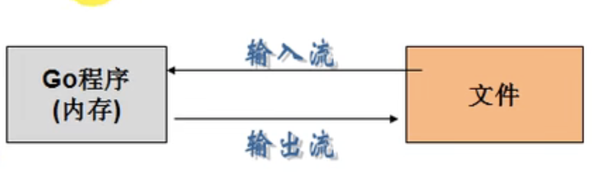

流：数据在数据源（文件）和程序（内存）之间经历的路径

输入流： 数据从数据源（文件）到程序（内存）的路径

输出流：数据从程序（内存）到数据源（文件）的路径

os.File封装所有文件相关操作，File 是一个结构体

### 14.2 常用的文件操作函数和方法

1. 打开一个文件进行读操作

   ``` go
   os.Open(name string)(*File, error)
   // 例
   func main() {
     // 打开文件
     // 概念说明： file 的叫法
     // 1. file 叫 file 对象
     // 2. file 叫 file 指针
     // 3. file 叫 file 文件句柄
     file, err := os.Open("文件路径")
     if err != nil {
       fmt.Println("open file err=", err)
     }
     fmt.Printf("file = %v", file) //file 为文件指针变量（句柄实际上也是指针）
     // 关闭文件
     err = file.Close()
     if err != nil {
       fmt.Println("close file err=", err)
     }
   }
   ```

2. 关闭一个文件

   ``` go
   File.Close()
   ```

3. 判断文件是否存在

   golang 判断文件或文件夹是否存在的方法为使用 os.Stat()函数返回错误值进行判断

   1. 如果返回的错误为 nil，说明文件或文件夹不存在
   2. 如果返回的错误类型使用 os.IsNotExist()判断为 true，说明文件或文件夹不存在
   3. 如果返回的错误为其他类型，则不确定是否存在

   ``` go
   func PathExist(path string)(bool,error) {
     _, err := os.Stat(path)
     if err == nil { // 文件或者目录存在
       return true, nil
     }
     if os.IsNotExist(err) {
       return false, nil
     }
     return false, err
   }
   ```

4. copy 文件

   ``` go
   import (
    "bufio"
    "fmt"
    "io"
    "os"
   )
   
   func copyFile(dstFileName string, sreFileName string) (written int64, err error) {
    srcFile, err := os.Open(sreFileName)
    if err != nil {
     err = err
     return
    }
    defer srcFile.Close()
    // 通过 srcfile， 获取到 Reader
    reader := bufio.NewReader(srcFile)
    dstFile, err := os.OpenFile(dstFileName, os.O_WRONLY|os.O_CREATE, 0666)
    if err != nil {
     err = err
     return
    }
    defer dstFile.Close()
    writer := bufio.NewWriter(dstFile)
    return io.Copy(writer, reader)
   }
   ```

### 14.3 读文件操作应用实例

1. 读取文件的内容并**显示在终端**（带缓冲区的方式），使用 os.Open, file.Close, bufio.NewReader(), reader.ReadString 函数和方法

   ``` go
   package main
   
   import (
    "bufio"
    "fmt"
    "io"
    "os"
   )
   
   func main() {
   
    file, err := os.Open("/root/workspace/go_project/src/go_code/project4/main/main.go")
   
    if err != nil {
     fmt.Println("open file err = ", err)
    }
    // 当函数退出时，及时关闭 file
    defer file.Close()
    // 创建一个 *Reader， 是带缓冲的
    /**
    const (
     defaultBufSize = 4096 // 默认的缓冲区为 4096
    )
    */
    reader := bufio.NewReader(file)
    // 循环的读取文件的内容
    for {
     str, err := reader.ReadString('\n') // 读到一个换行就结束
     if err == io.EOF {                  // io.EOF表示文件的末尾
      break
     }
     // 输出内容
     fmt.Print(str)
    }
    fmt.Println("文件读取结束")
   }
   ```

2. 读取文件的内容并显示在终端（使用 ioutil 一次将整个文件读入内存中），这种方式**适用于文件不大**的情况，相关方法和函数（ioutil.ReadFile)

   ``` go
   import  "io/ioutil"
   // 没有显式的 Open文件， 因此不需要显式的 Close 文件
   // open 和 Close 被封装到 ReadFile 函数内部
   bytes, err := ioutil.ReadFile(file.Name())
    if err != nil {
     fmt.Println(err)
    }
    fmt.Println(string(bytes))
   
   ```

### 14.4 写文件操作应用实例

``` go
func OpenFile(name string, flag int, perm FileMode)(file *File, err error)
说明： os.OpenFile是一个更一般性的文件打开函数，它会使用指定的选项（如 O_RDONLY等）、指定的模式（如 0666 等）打开指定名称的文件，如果操作成功，返回文件对象可用于 I/O。如果出错，错误底层类型是*PathError
```

第二个参数：文件打开模式（可以组合）

```go
const (
    O_RDONLY int = syscall.O_RDONLY // 只读模式打开文件
    O_WRONLY int = syscall.O_WRONLY // 只写模式打开文件
    O_RDWR   int = syscall.O_RDWR   // 读写模式打开文件
    O_APPEND int = syscall.O_APPEND // 写操作时将数据附加到文件尾部
    O_CREATE int = syscall.O_CREAT  // 如果不存在将创建一个新文件
    O_EXCL   int = syscall.O_EXCL   // 和O_CREATE配合使用，文件必须不存在
    O_SYNC   int = syscall.O_SYNC   // 打开文件用于同步I/O
    O_TRUNC  int = syscall.O_TRUNC  // 如果可能，打开时清空文件
)
```

第三个参数：权限控制（Linux)

r->4, w->2, x-> 1

```go
const (
    // 单字符是被String方法用于格式化的属性缩写。
    ModeDir        FileMode = 1 << (32 - 1 - iota) // d: 目录
    ModeAppend                                     // a: 只能写入，且只能写入到末尾
    ModeExclusive                                  // l: 用于执行
    ModeTemporary                                  // T: 临时文件（非备份文件）
    ModeSymlink                                    // L: 符号链接（不是快捷方式文件）
    ModeDevice                                     // D: 设备
    ModeNamedPipe                                  // p: 命名管道（FIFO）
    ModeSocket                                     // S: Unix域socket
    ModeSetuid                                     // u: 表示文件具有其创建者用户id权限
    ModeSetgid                                     // g: 表示文件具有其创建者组id的权限
    ModeCharDevice                                 // c: 字符设备，需已设置ModeDevice
    ModeSticky                                     // t: 只有root/创建者能删除/移动文件
    // 覆盖所有类型位（用于通过&获取类型位），对普通文件，所有这些位都不应被设置
    ModeType = ModeDir | ModeSymlink | ModeNamedPipe | ModeSocket | ModeDevice
    ModePerm FileMode = 0777 // 覆盖所有Unix权限位（用于通过&获取类型位）
)
```

#### 14.4.1 基本应用实例-方式一

1. 创建一个新文件，写入内容 5 句“hello, Gardon"
2. 打开一个存在的文件中，将原来的内容覆盖成新的内容 10 句"你好，尚硅谷！"
3. 打开一个存在的文件，在原来的内容追加内容"ABC! ENGLISH"
4. 打开一个存在的文件，将原来的内容读出显示在终端，并且追加 5 句"hello, 北京！"

使用 os.OpenFile(), bufio.NewWriter(), *Writer的方法 WriteString 完成上面的任务

``` go
package main

import (
 "bufio"
 "fmt"
 "io"
 "os"
)

// 1. 创建一个新文件，写入内容 5 句“hello, Gardon"
func write1(filePath string) {

 file, err := os.OpenFile(filePath, os.O_WRONLY|os.O_CREATE, 0666)
 if err != nil {
  fmt.Printf("open file err = %v \n", err)
  return
 }
 defer file.Close()
 str := "hello, Gardon\n"
 // 写入时，使用带缓存的*Writer
 writer := bufio.NewWriter(file)
 for i := 0; i < 5; i++ {
  writer.WriteString(str)
 }
 // 内容是先写入到缓存的，所以需要调用 Flush 方法，将缓冲的数据真正
 // 写入到文件中，否则文件中会没有数据！！！
 writer.Flush()
}

// 2. 打开一个存在的文件中，将原来的内容覆盖成新的内容 10 句"你好，尚硅谷！"
func write2(filePath string) {

 // 因为 writer 是带缓存，因此在调用wirteString 方法时，其实
 file, err := os.OpenFile(filePath, os.O_WRONLY|os.O_TRUNC, 0666)
 if err != nil {
  fmt.Printf("open file err = %v \n", err)
  return
 }
 defer file.Close()

 writer := bufio.NewWriter(file)
 str := "你好啊\n"
 for i := 0; i < 10; i++ {
  writer.WriteString(str)
 }

 // 内容是先写入到缓存的，所以需要调用 Flush 方法，将缓冲的数据真正
 // 写入到文件中，否则文件中会没有数据！！！
 writer.Flush()
}

// 3. 打开一个存在的文件，在原来的内容追加内容"ABC! ENGLISH"
func write3(filePath string) {

 file, err := os.OpenFile(filePath, os.O_WRONLY|os.O_APPEND, 0666)
 if err != nil {
  fmt.Printf("open file err = %v \n", err)
  return
 }
 defer file.Close()
 str := "ABC! ENGLISH\n"
 // 写入时，使用带缓存的*Writer
 writer := bufio.NewWriter(file)
 for i := 0; i < 5; i++ {
  writer.WriteString(str)
 }
 // 内容是先写入到缓存的，所以需要调用 Flush 方法，将缓冲的数据真正
 // 写入到文件中，否则文件中会没有数据！！！
 writer.Flush()
}

// 4. 打开一个存在的文件，将原来的内容读出显示在终端，并且追加 5 句"hello, 北京！"
func readAndWrite(filePath string) {

 file, err := os.OpenFile(filePath, os.O_RDWR|os.O_APPEND, 0666)
 if err != nil {
  fmt.Printf("open file err = %v \n", err)
  return
 }
 defer file.Close()
 str := "你好北京\n"
 // 写入时，使用带缓存的*Writer
 reader := bufio.NewReader(file)
 // 循环的读取文件的内容
 for {
  str, err := reader.ReadString('\n') // 读到一个换行就结束
  if err == io.EOF {                  // io.EOF表示文件的末尾
   break
  }
  // 输出内容
  fmt.Print(str)
 }

 fmt.Println("文件读取结束")
 writer := bufio.NewWriter(file)
 for i := 0; i < 5; i++ {
  writer.WriteString(str)
 }
 // 内容是先写入到缓存的，所以需要调用 Flush 方法，将缓冲的数据真正
 // 写入到文件中，否则文件中会没有数据！！！
 writer.Flush()

}

func main() {
 filePath := "/tmp/text.txt"
 readAndWrite(filePath)

}

```

#### 14.4.2 基本应用实例-方式二

编程一个程序，将一个文件的内容，写入到另外一个文件，注：这两个文件已经存在了

说明

1. 使用 ioutil.ReadFIle / ioutil.WriteFile 完成写文件的任务

   ``` go
   package main
   
   import (
    "fmt"
    "io/ioutil"
   )
   
   func main() {
    file1Path := "/tmp/t1.txt"
    file2Path := "/tmp/t2.txt"
    data, err := ioutil.ReadFile(file1Path)
    if err != nil {
     // 说明 读取文件有错误
     fmt.Println("read file err=", err)
     return
    }
   
    err = ioutil.WriteFile(file2Path, data, 0666)
    if err != nil {
     fmt.Println("write file err=", err)
    }
   }
   ```

### 14.5 其他操作应用实例

#### 14.5.1 统计英文、数字、空格和其他字符数量

说明： 统计一个文件中含有的英文、数字、空格及其他字符数量

代码实现

``` go
package main

import (
 "bufio"
 "fmt"
 "io"
 "os"
 "unicode"
)

// 定义一个结构体， 用于保存统计结果
type CharCount struct {
 ChCount    int // 英文数量
 NumCount   int // 数字个数
 SpaceCount int // 空格个数
 OtherCount int // 其他字符个数
 HanCount   int // 汉字个数
}

func main() {
 // 思路： 打开一个文件，创建一个 Reader
 // 每读取一行，就去统计该行有多少个英文、数字、空格和其他字符
 // 然后将结果保存在一个结构体
 fileName := "/root/workspace/go_project/src/go_code/project5/exec01/main/main.go"
 file, err := os.Open(fileName)

 if err != nil {
  fmt.Println("open file error=", err)
  return
 }
 defer file.Close()
 reader := bufio.NewReader(file)
 var count CharCount
 for {
  str, err := reader.ReadString('\n')

  if err == io.EOF {
   break
  }
  r := []rune(str)
  for _, v := range r {
   switch {
   case v >= 'a' && v <= 'z':
    fallthrough
   case v >= 'A' && v <= 'Z':
    count.ChCount++
   case v == ' ' || v == '\t':
    count.SpaceCount++
   case v >= '0' && v <= '9':
    count.NumCount++
   case unicode.Is(unicode.Han, v):
    count.HanCount++
   default:
    count.OtherCount++
   }
  }

 }
 fmt.Printf("字母数: %v, 空格数: %v, 数字数:%v, 汉字数:%v, 其他字符:%v\n", count.ChCount, count.SpaceCount, count.NumCount, count.HanCount, count.OtherCount)
}
```

## 15 命令行参数

基本介绍

os.Args是一个 string 的切片，用来存储所有的命令行参数

``` go
package main

import (
 "fmt"
 "os"
)

func main() {
 args := os.Args
 fmt.Println("命令行的参数有,", args)

 for i, v := range args {
  fmt.Printf("args[%v]=%v\n", i, v)
 }
}
```

### 15.1 flag 包

flag 包用来解析命令行参数

说明：前面的方式是比较原生的方式，对解析参数不是特别的方便，特别是带有指定参数形式的命令行

比如： cmd > main.exe -f c:/aaa.txt -p 200 -u root 这样的形式命令行，go 设计者给我们提供了 flag 包，可以方便的解析命令行参数，而且参数顺序可以随意

``` go
package main

import (
 "flag"
 "fmt"
)

func main() {
 // 定义几个变量，用于接收命令行的参数值
 var user string
 var pwd string
 var host string
 var port int
 // &user 就是接收用户命令行中输入的 -u 后面的参数值
 // "u" 就是 -u 指定参数
 // "", 默认值
 // "用户名，默认为空"说明
 flag.StringVar(&user, "u", "", "用户名，默认为空")
 flag.StringVar(&pwd, "p", "", "用户名，默认为空")
 flag.StringVar(&host, "h", "", "用户名，默认为空")
 flag.IntVar(&port, "port", 3306, "用户名，默认为空")
 // 转换方法
 flag.Parse()
 fmt.Printf("user=%v, pwd=%v, host=%v, port=%v\n", user, pwd, host, port)
}
```

## 16 序列化与反序列化

基本介绍

JSON（javaScript Object Notation) 是一种轻量级的数据交换格式，易于人阅读和编写。同时也易于机器解析和生成

JSON 是在 2001 年开始推广使用的数据格式，目前已经成为了主流的数据格式

JSON 易于机器解析和生成，并有效地提升网络传输效率，通常程序在网络传输时会先将数据（结构体，map 等**序列化** json 字符串，到接收方得到 json 字符串时，在**反序列化**恢复成原来的数据类型（结构体、map 等）。这种方式已然成为各个语言的标准。

Json 数据格式说明

在 JS 语言中，一切都是对象。因此，任何的数据类型都可以通过 JSON 来表示，例如字符串、数字、对象、数组、map，结构体等

JSON 键值对是用来保存数据一种方法。

键/值对组合中的键名在前面并用双引号""包裹，使用冒号：分隔，然后紧接着值

### 16.1 JSON的序列化

json 序列化是指，将有 key-value 结构的数据类型（比如**结构体、map、切片**）序列化成 json 字符串的操作

``` go
package main

import (
 "encoding/json"
 "fmt"
)

// 对 map 进行 json 序列化
func testMap() {
 m1 := map[string]interface{}{}
 m1["name"] = "张三"
 m1["age"] = 12
 m1["address"] = "西安"
 m1Data, err := json.Marshal(m1)

 if err != nil {
  fmt.Println("解析错误", err)
 }
 fmt.Println(string(m1Data))
}

// 对切片 json 序列化
func testSlice() {
 mSlice := []map[string]interface{}{}
 m1 := map[string]interface{}{}
 m1["name"] = "张三"
 m1["age"] = 12
 m1["address"] = "西安"

 mSlice = append(mSlice, m1)

 m2 := map[string]interface{}{}
 m2["name"] = "李四"
 m2["age"] = 18
 m2["address"] = [2]string{"长安", "北京"}
 mSlice = append(mSlice, m2)
 data, err := json.Marshal(mSlice)
 if err != nil {
  fmt.Println("解析错误", err)
 }
 fmt.Println(string(data))

}

// 对基础类型 json 序列化还是它本身
func testFloat64() {
 num1 := 2345.23
 fmt.Printf("%T\n", num1)
 data, err := json.Marshal(num1)
 if err != nil {
  fmt.Println("解析错误", err)
 }

 fmt.Println(string(data))
}

func main() {
 testMap()
 testSlice()
 testFloat64()
}

```

注意事项

 对于结构体的序列化，可自定义字段的 key。只需给 struct 指定一个 tag 标签。

``` go
type Monster struct {
  Name string `json:"name"` // 反射机制
  Age int `json:"age"`
}
```

### 16.2 JSON 的反序列化

Json 反序列化是指，将 json 字符串反序列化或对应的数据类型（比如结构体、map、切片）的操作。

将 json 字符串反序列化成结构体、map 和切片。

``` go
package main

import (
 "encoding/json"
 "fmt"
)

type Person struct {
 Name    string `json:"name"`
 Age     int    `json:"age"`
 Address string `json:"address"`
}

// json 对象使用 struct 反序列化数据
func testStruct() {
 str := "{\"address\":\"西安\",\"age\":12,\"name\":\"张三\"}"
 var person Person
 json.Unmarshal([]byte(str), &person)
 fmt.Println(person)
}

// json 对象可以使用 map 接收
func testMap() {
 str := "{\"address\":\"西安\",\"age\":12,\"name\":\"张三\"}"
 var m1 map[string]interface{}
 // 注意: 反序列化 map，不需要 make，因为 make操作被封装到 Unmarshal 函数里
 json.Unmarshal([]byte(str), &m1)
 fmt.Println(m1)
}

// 数组类型的 json 数据使用切片接收
func testSlice() {
 str1 := "[{\"address\":\"西安\",\"age\":12,\"name\":\"张三\"},{\"address\":\"长安\",\"age\":18,\"name\":\" 李四\"}]"
 var m1 []map[string]interface{}
 // 注意: 反序列化 slice,不需要 make，因为 make操作被封装到 Unmarshal 函数里
 json.Unmarshal([]byte(str1), &m1)
 fmt.Println(m1)
}
func main() {
 testStruct()
 testMap()
 testSlice()
}
```

说明

1. 在反序列化一个 json 字符串时，要确保反序列化后的数据类型和原来序列化前的数据类型一致

## 17 单元测试

传统方法的缺点 分析

1. 不方便，我们需要在 main 函数中取调用，这样就需要去修改 main 函数，如果现在项目正在运行，就可能去停止项目
2. 不利于管理，因为当我们测试多个函数或者多个模块时，都需要写在 main 函数，不利于我们管理和清晰我们思路
3. 引出单元测试， -> testing 测试框架可以很好的解决这个问题

### 17.1 单元测试-基本介绍

Go 语言中自带一个轻量级的测试框架 testing 和自带的 go test 命令来实现单元测试和性能测试，testing 框架和其他语言中的测试框架类似，可以基于这个框架写针对相应函数的测试用例，也可以基于该框架写相应的压力测试用例，通过单元测试，可以解决如下问题：

1. 确保每个函数是**可运行的**，并且运行结果是正确的
2. 确保写出来的代码**性能是好的**
3. 单元测试可以及时的发现程序设计或者实现的逻辑错误，使问题及时暴露，便于问题的定位解决，而性能测试的重点在于发现程序设计上的一些问题，让程序能够在高并发的情况下还能保持稳定

``` go
// 被测试函数

package main

func addUpper(n int) (res int) {

 for i := 0; i <= n; i++ {
  res += i
 }
 return res
}

```

``` go
// 使用测试框架 命令为 go test -v (-v 显示详细信息)
package main

import "testing"

func TestAddUpper(t *testing.T) {
 res := addUpper(10)

 if res != 55 {
  t.Fatalf("addUpper(10) 的结果 %v 与预期 %v 不符", res, 55)
 }

 t.Logf("正确")
}
```

### 17.2 总结

1. 测试用例文件名必须以_test.go 结尾。 比如 cal_test.go ,cal 不是固定的

2. 测试用例函数必须以 Test 开孔，一般来说就是 Test+被测试的函数名， 比如 TestAddUpper。

3. TestAddUpper(t *testing.T)的形参类型必须是*testing.T

4. 一个测试用例文件中，可以有多个测试用例函数，比如 TestAddUpper、TestSub

5. 运行测试用例执行

   1. go test (如果运行正确，无日志，错误时会输出日志)
   2. go test -v (运行正确或者错误，都输出日志)

6. 当出现错误时，可以使用 t.Fatalf 来格式化输出错误信息，并退出程序

7. **t.Logf**方法可以输出相应的日志

8. 测试用例函数，并没有放在 main 函数中，也执行了，这就是测试用例的方便之处

9. **PASS** 表示测试用例运行成功，FAIL 表示测试用例运行失败

10. 测试单个文件，一定要带上被测试的源文件

    ``` bash
    go test -v cal_test.go cal.go
    ```

11. 测试单个方法

    ``` sh
    go test -v -test.run TestAddUpper
    ```

### 17.3 单元测试-综合案例

单元测试综合案例要求:

1. 编写一个Monster结构体，字段Name,Age,Skill
2. 给Monster绑定方法Store,可以将一个Monster变量(对象),序列化后保存到文件中

3. 给Monster绑定方法ReStore,可以将一个序列化的Monster,从文件中读取，并反序列化为Monster对象
4. 编程测试用例文件store_test.go，编写测试用例函数TestStore和TestRestore进行测试。

## 18 goroutine 和 channel

需求： 要求统计 1 - 20000 的数字中，哪些是素数？

分析思路：

1. 传统的方法，就是使用一个循环，循环的判断各个数是不是素数
2. 使用并发或者并行的方式，**将统计素数的任务分配给多个 goroutine 去完成**，这时就会使用到 goroutine

### 18.1 goroutine-基本介绍

#### 18.1.1 进程和线程说明

1. 进程就是程序在操作系统中的一次执行过程，是系统进行资源分配和调度的基本单位
2. 线程是进程的一个执行实例，是程序执行的最小单元，它是比进程更小的能独立运行的基本单位
3. 一个进程可以创建销毁多个线程，同一进程中的多个线程可以并发执行
4. 一个程序至少有一个进程，一个进程至少有一个线程

#### 18.1.2 并发和并行

1. 多线程程序在单核上运行，就是并发
2. 多线程程序在多核上运行，就是并行

**并发**：因为是在一个cpu上，比如有10个线程，每个线程执行10毫秒(进行轮询操作)，从人的角度看，好像这10个线程都在运行，但是从微观上看，在某一个时间点看，其实只有一个线程在执行，这就是并发。
**并行**：因为是在多个cpu上(比如有10个cpu)，比如有10个线程，每个线程执行10毫秒(各自在不同cpu上执行)，从人的角度看，这10个线程都在运行，但是从微观上看，在某一个时间点看，也同时有10个线程在执行，这就是并行

#### 18.1.3 Go 协程和 Go 主线程

1. Go 主线程：一个Go 线程上，可以起多个协程，**协程是轻量级的进程**（编译器做优化）
2. Go 协程的特点
   1. 有独立的栈空间
   2. 共享程序堆空间
   3. 调度由用户控制
   4. 协程是轻量级的线程

``` go
package main

import (
 "fmt"
 "time"
)

// 在主线程(可以理解成进程)中，开启一个goroutine，该协程每隔1秒输出 "hello,world"
// 在主线程中也每隔一秒输出"hello,golang"，输出10次后，退出程序
// 要求主线程和goroutine同时执行

// 编写一个函数，每隔 1 秒输出“hello， world”
func test() {
 for i := 1; i < 10; i++ {
  fmt.Println("test(): hello, world", i)
  time.Sleep(time.Second)
 }
}
func main() {
 // 当然协程也可以在主线程没有退出前，就自己结束了，比如完成了自己的任务
 go test() // 开启一个协程
 // 如果主线程退出了，则协程即使还没有执行完毕，也会退出

 for i := 1; i < 2; i++ {
  fmt.Println("main(): hello, golang", i)
  time.Sleep(time.Second)
 }

}
```

#### 18.1.4 小结

1. 主线程是一个物理线程，直接作用在 cpu 上，是重量级的，非常耗费 cpu 资源
2. 协程从主线程开启的，是轻量级的线程，是逻辑态。对资源消耗相对小
3. Golang 的协程机制是重要的特点，可以轻松的开启上万个协程。其他编程语言的开发机制是一般基于线程的，开启过多的线程，资源耗费大，这里就凸显 Golang 在并发的优势了。

### 18.2 goroutine的调度模型

#### 18.2.1 MPG模式基本介绍

1. M： 操作系统的主线程（是物理线程）
2. P： 协程执行需要的上下文
3. G：协程

#### 18.2.2 MPG 模式运行的状态 1

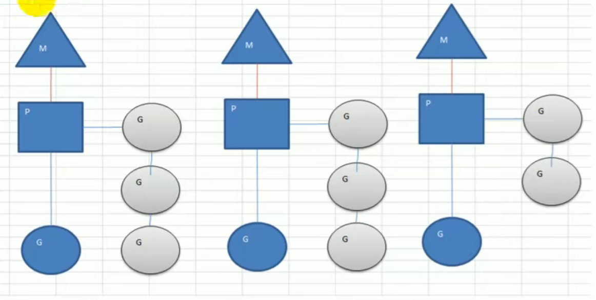

  1) 当前程序有三个M,如果三个M都在一个cpu运行，就是并发，如果在不同的cpu运行就是并行
2) M1,M2,M3正在执行一个G，M1的协程队列有三个，M2的协程队列有3个， M3协程队列有2个
3) 从上图可以看到: Go的协程是轻量级的线程，是逻辑态的，Go可以容易的起上万个协程,
4) 其它程序c/java的多线程，往往是内核态的，比较重量级，几千个线程可能耗光cpu

#### 18.2.3 MPG 模式运行的状态 2

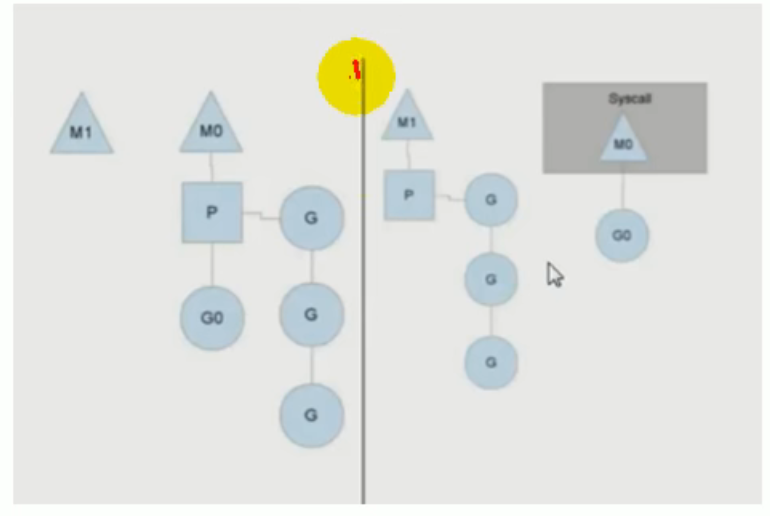

1. 分成两个部分来看
2. 原来的情况是MO主线程正在执行GO协程，另外有三个协程在队列等待
3. 如果GO协程阻塞，比如读取文件或者数据库等
4. 这时就会创建M1主线程(也可能是从已有的线程池中取出M1)，并且将等待的3个协程挂到M1下开始执行，M0的主线程下的GO仍然执行文件io的读写。

5. 这样的MPG调度模式，可以既让GO执行，同时也不会让队列的其它协程一直阻塞，仍然可以并发/并行执行。
6. 等到GO不阻塞了，M0会被放到空闲的主线程继续执行(从已有的线程池中取),同时GO又会被唤醒。

#### 18.2.4 设置 Golang 运行的 cpu 数

1. go1.8 后，默认让程序运行在多个核上，可以不用设置了
2. go1.8 前，还是要设置一下，可以更高效的利用 cpu

``` go
package main

import (
 "fmt"
 "runtime"
)

func main() {
 cpuNum := runtime.NumCPU()
 fmt.Println(cpuNum)

 // 可以自己设置多个 cpu
 // procs := runtime.GOMAXPROCS(cpuNum - 1)
 runtime.GOMAXPROCS(cpuNum - 1)
}
```

### 18.3 channel(管道)

需求：现在要计算 1-200 的各个数的阶乘，并且把各个数的阶乘放入到map中。最后显示出来。要求使用goroutine完成
分析思路：

1. 使用goroutine 来完成，效率高，但是会出现**并发/并行安全问题.**

2) 这里就提出了不同goroutine如何通信的问题

代码实现

1. 使用goroutine来完成(看看使用gorotine并发完成会出现什么问题？然后我们会去解决)

2) 在运行某个程序时，如何知道是否存在资源竞争问题。 方法很简单，在编译该程序时，增加一个参数 -race即可
3) 代码实现

问题

1. 因为没有对全局变量 myMap 加锁，因此会出现资源争夺问题，代码会出现错误，提示 concurrent map writes
2. 解决方案，加入互斥锁
3. 我们的数的阶乘很大，结果会越界，可以将求阶乘改为 sum+=uint64(i)
4. 代码改进，加互斥锁

``` go
package main

import (
 "fmt"
 "sync"
 "time"
)

//需求：现在要计算 1-200 的各个数的阶乘，并且把各个数的阶乘放入到map中。最后显示出来。要求使用goroutine完成
//分析思路：

// 思路
// 1. 编写一个函数，来计算各个数的阶乘，并放入 map 中
// 2. 我们启动的协程多个，统计的结果放入 map 中
// 3. map应该做出一个全局的

var (
 myMap = make(map[int]uint64, 10)
 // 声明一个全局的互斥锁
 // lock 是一个全局的互斥锁
 // sync 是包： synchornized 同步
 // Mutex:是互斥的
 lock sync.Mutex
)

func test(n int) {
 var res uint64
 res = 1
 for i := 1; i <= n; i++ {
  res *= uint64(i)
 }

 // 这里我们将 res 放入到 myMap 中
 lock.Lock()
 myMap[n] = res
 lock.Unlock()
}

func main() {
 // 我们这里开启多个协程完成任务
 for i := 1; i <= 200; i++ {
  go test(i)
 }
 time.Sleep(time.Second * 10)

 lock.Lock()
 // 输出结果，遍历结果
 for k, v := range myMap {
  fmt.Println(k, v)
 }
 lock.Unlock()
}
```

多个协程共同操作 map 导致并发写的问题

#### 18.3.1 不同 goroutine 之间如何通讯

1. 全局变量加锁同步
2. channel

#### 18.3.2 chanel（管道）-基本介绍

> 为什么需要 channel
>
> 1. **主线程在等待所有 goroutine 全部完成的时间很难确定**
> 2. 如果主线程休眠时间长了，会加长等待时间，如果等待时间断了，可能还有 goroutine 处于工作状态，这时也会随着主线程的退出而销毁
> 3. 通过全局变量加锁同步来实现通讯，也并不利用多个协程对全局变量的读写操作
> 4. 上面种种分析都在呼唤一个新的通讯机制-channel

1. channel 本质就是一个数据结构-队列
2. 数据是先进先出（**FIFO**:first in first out)
3. 线程安全，多 goroutine 访问时，不需要加锁，就是说 channel 本身就是线程安全的
4. channel 是有类型的，一个 string 的 channel 只能存放 string 类型数据

#### 18.3.3 channel(管道) - 基本使用

##### 定义/声明 channel

``` go
var 变量名 chan 数据类型
// 举例
var intChan chan int (intChan 用于存放 int 数据)
var mapChan chan map[int]string(mapChan用于存放 map[int]string 类型)
var perChan chan Person
var perChan2 chan *Person
```

说明

1. channel是引用类型
2. channel 必须初始化才能写入数据，即 make 后才能使用
3. 管道是有类型的，intChan只能写入整数 int

##### channel 初始化

说明：使用 make 进行初始化

``` go
var intChan chan int
intChan = make(chan int, 10)
```

##### 向 channel 中写入（存放）数据

``` go
var intChan chan int
intChan = make(chan int, 10)
num := 99
intChan <- 10
intChan <- num

```

##### 从 channel 中取出数据

``` go
var intChan chan int
intChan = make(chan int, 10)
num := 99
intChan <- 10
intChan <- num
x, ok := <- intChan  // ok 表示是否从管道中取出数据
```

##### 练习

``` go
package main

import "fmt"

func main() {
 // 演示管道的使用
 // 1. 创建一个可以存放 3 个 int 类型的管道
 intChan := make(chan int, 3)

 // 2. 看看 intChan 是什么
 fmt.Println(intChan, &intChan)

 // 3. 向管道写入数据
 intChan <- 10
 num := 211
 intChan <- num

 // 注意点，当我们给管道写入数据时,不能超过其容量
 intChan <- 2
 // 4. 看看管道的长度和 cap(容量)
 fmt.Printf("channel len = %v  cap = %v \n", len(intChan), cap(intChan))

 // 5. 从管道中读取数据
 // var num2 int
 // num2 = <-intChan
 <-intChan
 fmt.Println(<-intChan)
 // 6. 在没有使用协程的情况下，如果我们的管道数据已经全部取出，在去就会报告 deadlock
 <-intChan
 <-intChan
}
```

``` go
package main

import "fmt"

type Cat struct {
 Name string
 Age  int
}

func main() {

 // 定义一个存放任意数据类型的管道 3 个数据
 allChan := make(chan interface{}, 3)
 allChan <- 10
 allChan <- "tom jack"
 cat := Cat{"小花猫", 4}
 allChan <- cat
 // 我们希望获取到管道中的第三个元素，则先将前两个推出
 <-allChan
 <-allChan
 newCat := <-allChan // 从管道取出的是 interface{} 需要使用类型断言转成 Cat

 fmt.Printf("%T\n", newCat)
 // 需要使用类型断言
 fmt.Printf("newCat.Name=%v", newCat.(Cat).Name)

}
```

##### channel 使用的注意事项

1. channel 中只能存放指定的数据类型
2. channel 的数据放满后，就不能再放入了
3. 如果从 channel 取出数据后，可以继续放入
4. 在没有使用协程的情况下，如果 channel 数据取完了，再取，就会报 dead lock

##### channel 的关闭

使用内置函数 close 可以关闭 channel，当 channel 关闭后，就不能再向 channel 写数据了，但是仍然可以从该 channel 读取数据

##### channel 的遍历

channel 支持 for-range 的方式进行遍历，请注意两个细节

1. 在遍历时，如果 channel 没有关闭，则会出现 deadlock 的错误
2. 在遍历时，如果 channel 已经关闭，则会正常遍历数据，遍历完后，就会退出遍历

``` go
package main

import "fmt"

func main() {

 // 创建管道
 intChan := make(chan int, 100)

 for i := 0; i < 100; i++ {
  intChan <- i * 2 // 放入 100 个数据到管道
 }

 // 在遍历时，如果 channel 没有关闭，则会出现 deadlock 的错误
 // 如果 channel 已经关闭，则会正常遍历数据，遍历完后，就会退出遍历
 close(intChan)
 for v := range intChan {
  fmt.Println("v =", v)
 }
}
```

### 18.4 goroutine和 channel 结合

#### 应用实例 1

1. 开启一个 writeData 协程，向管道 intChan 中写入 50 个整数
2. 开启一个 readData 协程，从管道 intChan 中读取 write 写入的数据
3. 注意：writeData 和 readData操作的是同一个管道
4. 主线程需要等待 writeData 和 readData 协程都完成工作才能退出【管道】

``` go
package main

import "fmt"

func writeData(intChan chan int) {
 for i := 1; i <= 50; i++ {
  // 放入数据
  intChan <- i
 }
 close(intChan) // 关闭
}

// read data
func readData(intChan chan int, exitChan chan bool) {

 for {
  v, ok := <-intChan

  if !ok {
   break
  }

  fmt.Printf("readData 读到数据 = %v \n", v)
 }
 // readData 读取完整数据 即任务完成
 exitChan <- true
 close(exitChan)
}

func main() {

 // 创建两个管道
 intChan := make(chan int, 10)
 exitChan := make(chan bool, 1)

 go readData(intChan, exitChan)
 go writeData(intChan)

 for {
  v, ok := <-exitChan
  if ok && v {
   break
  }
 }
}
```

问题：如果注销掉 go readData(intChan, exitChan), 程序会怎么样？

答： 如果只是向管道写入数据，而没有读取，就会出现阻塞而 deadlock，原因是 intChan 容量是 10，而代码 writeData 会写入 50 个数据，因此会阻塞在 writeData 的 ch <- i。（如果编译器（运行）发现一个管道只有写，而没有读，则该管道会阻塞。写管道和读管道的频率不一致，无所谓）

#### 应用实例 2

要求

1. 启动一个协程，将 1-2000 的数放入到一个 channel 中，比如 numChan
2. 启动 8 个协程，从 numChan 取出数（比如 n), 并计算 1 + ... + n 的值，并存放到 resChan
3. 最后 8 个协程同完成工作后，再遍历 resChan，显示结果[如 res[1] = 1.. res[10] = 55]
4. 注意： 考虑 resChan chan int 是否合适？

代码

``` go
package main

import (
 "fmt"
)

func cal(numChan chan int, resChan chan string, exitChan chan bool) {

 for {

  num, ok := <-numChan
  if !ok {
   break
  }

  sum := (num * (1 + num)) >> 1
  resChan <- fmt.Sprintf("res[%v]=%v", num, sum)
 }

 exitChan <- true
}

func writeData(numChan chan int) {
 for i := 1; i <= 2000; i++ {
  numChan <- i
 }

 close(numChan)
}

func main() {

 numChan := make(chan int, 10)

 resChan := make(chan string, 2000)

 exitChan := make(chan bool, 8)

 go writeData(numChan)

 for i := 1; i <= 8; i++ {
  go cal(numChan, resChan, exitChan)
 }

 go func() {
  for i := 0; i < 8; i++ {
   <-exitChan
  }
  close(resChan)
 }()

 for {
  res, ok := <-resChan

  if !ok {
   break
  }

  fmt.Println(res)
 }

}
```

#### 应用实例 3

要求

1. 开一个协程writeDataToFile， 随机生成 1000 个数据，存放到文件中
2. 当writeDataToFile 完成写 1000个数据到文件后,让sort 协程从文件中读取 1000个文件，并完成排序，重新写入到另外一个文件

3) 考察点：协程和管道+文件的综合使用

4. 功能扩展：开 10 个协程writeDataToFile，每个协程随机生成 1000个数据，存放到10文件中
5. 当 10个文件都生成了，让 10个sort 协程从 10文件中读取 1000 个文件，并完成排序，重新写入到 10 个结果文件

``` go
```

#### 应用实例 4

需求：要求统计1-200000的数字中，哪些是素数？这个问题在本章开篇就提出了，现在我们有goroutine和channel的知识后，就可以完成了 [测试数据:80000]
分析思路：

传统的方法，就是使用一个循环，循环的判断各个数是不是素数。使用并发/并行的方式，**将统计素数的任务分配给多个（4个/goroutine去完成**，完成任务时间短。
1.画出分析思路 2.代码实现
说明：使用goroutine完成后，可以在使用传统的方法来统计一下，看看完成这个任务，各自耗费的时间是多少？[用map保存primeNum]

``` go
package main

import (
 "fmt"
 "time"
)

func putNum(intChan chan int) {

 for i := 1; i < 20000; i++ {
  intChan <- i
 }

 close(intChan)
}

// 从 intChan 取出数据，并判断是否为素数， 如果是就放入 primeChan
func primeNum(intChan chan int, primeChan chan int, exitChan chan bool) {

 for {
  // time.Sleep(5 * time.Millisecond)
  num, ok := <-intChan

  if !ok {
   break
  }
  flag := true
  for i := 2; i < num; i++ {
   if num%i == 0 { // 说明该 num 不是素数
    flag = false
    break
   }
  }

  if flag {
   // 将这个数放入到 primeChan
   primeChan <- num
  }
 }

 fmt.Println("有一个 primeNum 协程因取不到数据，退出")
 exitChan <- true
}

func main() {

 intChan := make(chan int, 1000)
 primeChan := make(chan int, 2000) // 放入结果
 // 标识退出的管道
 exitChan := make(chan bool, 4)
 // 开启一个协程，向 intChan 放入 1 - 8000 个数

 start := time.Now().Unix()
 // go putNum(intChan)
 go putNum(intChan)

 for i := 0; i < 4; i++ {
  go primeNum(intChan, primeChan, exitChan)
 }

 // 这里主线程进行处理
 go func() {
  for i := 0; i < 4; i++ {
   <-exitChan
  }

  end := time.Now().Unix()
  fmt.Println("使用协程耗时=", end-start)
  close(primeChan)
 }()

 for {
  res, ok := <-primeChan
  if !ok {
   break
  }
  fmt.Printf("素数=%d\n", res)
 }

 fmt.Println("main线程退出")
}
```

#### channel 使用细节和注意事项

1. channel 可以声明为只读，或者只写性质
2. channel 只读和只写最佳实践案例

``` go
package main

func main() {
 // 管道可以声明为只读或者只写

 // 1. 在默认情况下，管道是双向的
 // var chan1 chan int // 可读可写

 // 2. 声明为只写
 var chan2 chan<- int
 chan2 = make(chan int, 3)
 chan2 <- 20
 // 3. 声明为只读

 var chan3 <-chan int
 <-chan3

 // 可读可写
 var ch chan int
 ch = make(chan int, 10)

 go send(ch)
 go receive(ch)
}

// 只写
func send(ch chan<- int) {}
// 只读
func receive(ch <-chan int) {}

```

3. 使用 select 可以解决从管道取数据的阻塞问题

   ``` go
   package main
   
   import "fmt"
   
   func main() {
    // 使用 select 解决从管道读取数据的阻塞问题
   
    // 1. 定义一个管道 10 个数据 int
    intChan := make(chan int, 10)
    for i := 0; i < 10; i++ {
     intChan <- i
    }
   
    // 2. 定义一个管道 5 个数据 string
    stringChan := make(chan string, 5)
    for i := 0; i < 5; i++ {
     stringChan <- "hello" + fmt.Sprintf("%d", i)
    }
   
    // 传统的方法在遍历管道时，如果不关闭会阻塞而导致 deadlock
   
    // 问题， 在实际开发中，可能我们不好确定什么时候关闭该通道
    // 可以使用 select 方式可以解决
    for {
     select {
     // 注意： 这里，如果 intChan 一直没有关闭，不会一直阻塞 deadlock
     // 会自动到下一个 case 匹配
     case v := <-intChan:
      fmt.Println("从 intChan 读取的数据", v)
   
     case v := <-stringChan:
      fmt.Println("从 stringChan 读取的数据", v)
     default:
      fmt.Println("不玩了")
      // 退出
      return 
     }
    }
   }
   ```

4. goroutine 中使用 recover，解决协程中出现 panic，导致程序崩溃的问题

> 说明：如果我们起了一个协程，但是这个协程出现了panic，如果我们没有捕获这个panic,就会造成整个程序崩溃，这时我们可以在goroutine中使用recover来捕获panic, 进行处理，这样即使这个协程发生的问题，但是主线程仍然不受影响，可以继续执行。

``` go
func test() {
  defer func() {
    if err := recover(); err != nil {
      fmt.Println("发生错误", err)
    }
  }
}
```

## 19 反射（Reflect）

### 19.1 基本介绍

1. 反射可以**在运行时动态获取变量的各种信息**，比如变量的类型(type)，类别(kind)
2. 如果是结构体变量，还可以获取到结构体本身的信息（包括结构体的字段、方法）
3. 通过反射，可以修改变量的值，可以调用关联的方法
4. 使用反射，需要 import("reflect")

### 19.2 反射的应用场景

1. 不知道接口调用哪个函数，根据传入参数在运行时确定调用的具体接口，这种需要对函数或者方法反射。例如以下这种桥接模式

   ``` go
   func bridge(funcPtr interface{}, args ...interface{})
   ```

   第一个参数 funcPtr 以接口的形式传入函数指针，函数参数 args 以可变参数的形式传入，bridge 函数中可以用反射来动态执行 funcPtr 函数

2. 对结构体序列化时，如果结构体有指定 Tag，也会使用到反射生成对应的字符串

### 19.3 反射重要的函数和概念

1. reflect.TypeOf(变量名)， 获取变量的类型， 返回 reflect.Type 类型

2. reflect.ValueOf(变量名), 获取变量的值，返回 reflect.Value 类型，reflect.Value 是一个结构体类型。通过 reflect.Value可以获取到关于该变量的很多信息

3. 变量、interface{}和 reflect.Value 是可以相互转换的，在实际开发中会经常使用到

   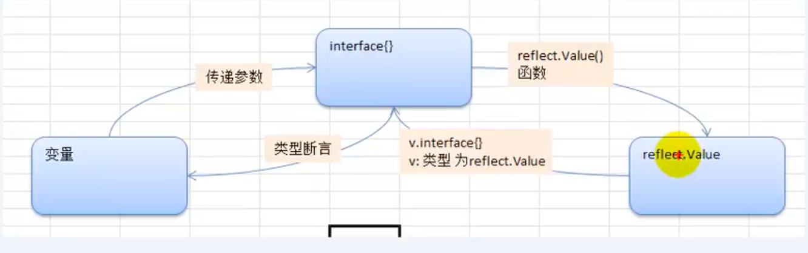

   ``` go
    // 专门用于反射
   func test(b interface{}) {
     // 1. 如何将 interface{} 转成 reflect.Value
     rVal := reflect.ValueOf(b)
     // 2. 如何将 reflect.Value -> interface
     iVal := rVal.Interface()
     // 3. 如何将 interface{} 转成原来的变量类型，使用类型断言
     v := iVal.(Stu)
   }
   
   func main() {
     var student Stu
     test(student)
   }
   ```

### 19.4 反射注意事项和细节说明

1. reflect.Value.Kind, 获取变量的类别，返回的是一个常量

2. Type是类型，Kind 是类别，**Type 和 Kind 可能是相同的**，也可能是不同的

   ``` go
   // 比如
   var num int = 10 // num 的 Type是 int, Kind也是 int
   var stu Student // stu的 Type 是包名.Student, Kind是 struct
   ```

3. 通过反射可以让变量在 interface{} 和 Reflect.Value之间相互转换

4. 使用反射的方式来获取变量的值（并返回对应的类型），要求数据类型匹配，比如 x 是 int，那么就应该使用 reflect.Value(x).Int(),而不能使用其他，否则报 panic

5. 通过反射来修改变量，注意当使用 SetXxx方法来设置需要通过对应的指针类型来完成，这样才能改变传入的变量的值，同时需要使用到 reflect.Value.Elem()方法

   ``` go
   package main
   
   import (
    "fmt"
    "reflect"
   )
   
   // 通过反射，修改
   // num int 的值
   // 修改 student 的值
   
   func reflect01(b interface{}) {
    // 2. 获取到 reflect.Value
    rVal := reflect.ValueOf(b)
   
    // 看看 rVal 的 Kind 是
    fmt.Printf("rVal kind = %v\n", rVal.Kind())
    // 3. 通过反射改变值
    // Elem 返回 v 持有的接口保管的值的 Value 封装，或者 v 持有的指针指向的值的 Value 封装
    rVal.Elem().SetInt(20)
   }
   
   func main() {
   
    var num int = 10
    reflect01(&num)
    fmt.Println(num)
   }
   ```

### 19.5 反射课堂练习

1. 给你一个变量 var float64 = 1.2, 请使用反射来得到它的 reflect.Value, 然后获取对应的 Type， Kind 的值，并将 reflect.Value 转换成 interface{}, 再将 interface{} 转换成 float64

2. 看段代码，判断是否正确，为什么？

   ``` go
   package main
   import  (
    "fmt"
     "reflect"
   )
   
   func main() {
     var str string = "tom"
     fs := reflect.ValueOf(str)
     fs.SetString("jack") // 运行时错误， 需要写成 fs.Elem().SetString("jack")
     fmt.Printf("%v\n", str)
   }
   ```

### 19.6 反射最佳实践

1. 使用反射来遍历结构体的字段，调用结构体的方法，并获取结构体标签的值

   ``` go
   func (v Value) Method(i int) Value // 默认按方法名排序对应 i 值， i 从 0 开始
   func (v Value) Call(in []Value) []Value// 传入参数和返回参数是[]reflect.Value
   
   // 反射的 structtag的核心代码
   tag := tye.Elem().Field(0).TagGet("json")
   fmt.Printf("tag=%s\n", tag)
   ```

   ``` go
   package main
   
   import (
    "fmt"
    "reflect"
   )
   
   // 定义一个 Monster 结构体
   type Monster struct {
    Name  string `json:"name"`
    Age   int    `json:"monster_age"`
    Score float32
    Sex   string
   }
   
   // 方法， 显示 s 的值
   func (s Monster) Print() {
    fmt.Println("----- start ----")
    fmt.Println(s)
    fmt.Println("----- end -----")
   }
   
   // 方法， 返回两个数的和
   func (s Monster) GetSum(n1, n2 int) int {
    return n1 + n2
   }
   
   // 方法， 接收 四个值， 给 s 赋值
   func (s Monster) Set(name string, age int, score float32, sex string) {
    s.Name = name
    s.Age = age
    s.Score = score
    s.Sex = sex
   }
   
   func TestStruct(a interface{}) {
    // 获取 reflect.Type 类型
    typ := reflect.TypeOf(a)
    // 获取 reflect.Value类型
    val := reflect.ValueOf(a)
    // 获取到 a 对应的类别
    kd := val.Kind()
    // 如果传入的不是 struct，就退出
    if kd != reflect.Struct {
     fmt.Println("expect struct")
     return
    }
   
    // 获取到该结构体有几个字段
    num := val.NumField()
   
    fmt.Printf("struct has %d fields \n", num)
   
    // 变量结构体的所有字段
   
    for i := 0; i < num; i++ {
     fmt.Printf("Field %d: 值为 %v \n", i, val.Field(i))
     // 获取到 struct 标签，注意需要通过 reflect.Type 来获取 tag 标签的值
     tagVal := typ.Field(i).Tag.Get("json")
     if tagVal != "" {
      fmt.Printf("Field %d tag 为 %v \n", i, tagVal)
     }
    }
   
    // 获取到该结构体有多少个方法
    numOfMethod := val.NumMethod()
   
    fmt.Printf("struct has %d methods \n", numOfMethod)
   
    for i := 0; i < numOfMethod; i++ {
     fmt.Println(val.Method(i).String())
    }
    // 方法的排序默认 是按照，(ASCII)码排序
    val.Method(1).Call(nil) // 获取到第二个方法，调用它
    // 调用结构体的第 1 个方法 Method(0)
    var params []reflect.Value
    params = append(params, reflect.ValueOf(10))
    params = append(params, reflect.ValueOf(40))
    res := val.Method(0).Call(params) // 传入的参数是[]reflect.Value
    fmt.Println("res=", res[0].Int()) // 返回结果，返回的结果是[]reflect.Value
   
   }
   
   func main() {
   
    m := Monster{
     Name:  "牛魔王",
     Age:   18,
     Score: 22,
     Sex:   "男",
    }
   
    TestStruct(m)
   }
   ```

2. 使用反射的方式来获取结构体的 tag 标签，遍历字段的值，修改字段的值，调用结构体方法（要求：通过传递地址的方式完成）

   ``` go
   核心使用 reflect.Value.Elem().SetXxx()
   ```

3. 定义两个函数 test1和test2， 定义一个**适配器函数**用作统一处理接口

   ``` go
   package test
   
   import (
    "reflect"
    "testing"
   )
   // 使用传统的方式
   func TestBridgeFunc(t *testing.T) {
   
    test1 := func(v1, v2 int) {
     t.Log(v1, v2)
    }
   
    test2 := func(v1, v2 int, s string) {
     t.Log(v1, v2, s)
    }
   
    bridge := func(cal interface{}, args ...interface{}) {
     switch cal.(type) {
     case func(int, int):
      cal.(func(int, int))(args[0].(int), args[1].(int))
     }
    }
   
    bridge(test1, 1, 2)
    bridge(test2, 1, 2, "test2")
   }
   
   // 使用反射的方式
   func TestReflectFunc(t *testing.T) {
    test1 := func(v1, v2 int) {
     t.Log(v1, v2)
    }
   
    test2 := func(v1, v2 int, s string) {
     t.Log(v1, v2, s)
    }
   
    bridge := func(cal interface{}, args ...interface{}) {
     inValue := []reflect.Value{}
     for _, v := range args {
      inValue = append(inValue, reflect.ValueOf(v))
     }
   
     function := reflect.ValueOf(cal)
     function.Call(inValue)
    }
   
    bridge(test1, 1, 3)
    bridge(test2, 3, 4, "test222")
   
   }
   ```

4. 使用反射操作任意结构体类型

   ``` go
   package apply03_test
   
   import (
    "reflect"
    "testing"
   )
   
   func TestReflectStruct(t *testing.T) {
    type user struct {
     UserId string
     Name   string
    }
   
    model := &user{}
    sv := reflect.ValueOf(model)
    t.Log("reflect.ValueOf", sv.Kind().String())
   
    sv = sv.Elem()
    t.Log("reflect.ValueOf.Elem", sv.Kind().String())
    sv.FieldByName("UserId").SetString("123124")
    sv.FieldByName("Name").SetString("nickname")
    t.Log("model", model)
   
   }
   
   ```

5. 使用反射创建并操作结构体

   ``` go
   package apply03_test
   
   import (
    "reflect"
    "testing"
   )
   
   func TestReflectStruct(t *testing.T) {
    type user struct {
     UserId string
     Name   string
    }
   
    var model *user
    st := reflect.TypeOf(model)                            // 获取类型 *user
    t.Log("reflect.ValueOf", st.Kind().String())           // ptr
    st = st.Elem()                                         //  st 指向的类型
    t.Log("reflect.ValueOf.Elem", st.Kind().String())      // struct
    elem := reflect.New(st)                                // New 返回一个 Value 类型值，该值持有一个指向类型为 typ 的新申请的零值的指针
    t.Log("reflect.New", elem.Kind().String())             // ptr
    t.Log("reflect.New.Elem", elem.Elem().Kind().String()) // struct
    // model 就是创建 user 结构体变量（实例）
    model = elem.Interface().(*user) // model 是 *user 它的指向和 elem 是一样的
    elem = elem.Elem()               // 获取 elem 指向的值
   
    //model.Name = "xxxxx"
    //model.UserId = "1231232"
    elem.FieldByName("UserId").SetString("123124")
    elem.FieldByName("Name").SetString("nickname")
    t.Log("model", model)
   }
   ```

## 20 网络编程

### 20.1 网络编程基本介绍

Golang的主要设计目标之一就是面向大规模后端服务程序，网络通信这块是服务端程序必不可少也是至关重要的一部分

网络编程有两种：

1. **TCP socket 编程**， 是网络编程的主流，之所以叫 Tcp socket 编程是因为底层是基于 Tcp/Ip 协议的
2. b/s 结构的 **http 编程**，http 底层仍然是用 tcp socket 实现的

### 20.2 协议（tcp/ip)

TCP/IP(Transmission Control Protocol / Internet Protocol) 的简写，中文译名为传输控制协议/ 因特网互联协议，又叫网络通讯协议

#### OSI 和 Tcp/ip 参考模型

- 应用层（application) smtp,ftp,telnet,http
- 传输层(transport) 解释数据
- 网络层：(ip) 定位 ip 地址和确定连接路径
- 链路层：(link)与硬件驱动对话

### 20.3 端口

端口范围 0 ~ 65535

端口分类

- 0 号是保留端口
- 1-1024 是固定端口，又叫**有名端口**，即被某些程序固定使用，一般程序员不使用
  - 22：SSH 远程登录协议
  - 23：telnet 使用
  - 21：ftp 使用
  - 25：smtp 服务使用
  - 80：iis 使用
  - 7：echo 服务
- 1025 ~ 65535 是动态端口，程序员可以使用

#### 端口-使用注意

1. 计算机（尤其是服务器）尽可能的少开端口
2. 一个端口只能被一个程序监听
3. 如果使用 netstat -an 可以查看本机有哪些端口在监听
4. 可以使用 netstat -anb 来查看监听端口的 pid， 在结合任务管理器关闭不安全的端口

### 20.4 tcp socket编程

#### 服务端的处理流程

1. 监听端口
2. 接收客户端的 tcp 链接，建立客户端和服务端的链接
3. 创建 **goroutine**， 处理该链接的请求（通常客户端会通过链接发送请求包）

#### 客户端的处理流程

1. 建立和服务端的链接
2. 发送请求数据，接收服务端返回的结果数据
3. 关闭链接

#### 应用实例

服务端功能

1. 编写一个服务端程序，在 8888 端口监听
2. 可以和多个客户端创建链接
3. 链接成功后，客户端可以发送数据，服务端接受数据，并显示在终端上
4. 使用 telnet 测试

``` go
package main

import (
 "fmt"
 "net"
)

func process(conn net.Conn) {
 // 延迟关闭连接
 defer conn.Close()

 for {
  // 创建一个切片
  buf := make([]byte, 1024)
  // conn.Read(buf)
  // 1. 等待客户端通过 conn 发送消息
  // 2. 如果客户端没有 write[发送]，那么协程就阻塞在这里
  fmt.Printf("服务端等待客户端 %s 发送消息\n", conn.RemoteAddr().String())
  n, err := conn.Read(buf) // 从 conn 读取
  if err != nil {
   // fmt.Println("服务端的 Read err=", err)
   fmt.Println("客户端退出， err =", err)
   return
  }
  // 3. 显示客户端发送的内容到服务器的终端
  fmt.Print(string(buf[:n]))
 }

}

func main() {
 listen, err := net.Listen("tcp", "0.0.0.0:8888")
 fmt.Println("服务器开始监听...")
 if err != nil {
  fmt.Println("listen err=", err)
  return
 }

 defer listen.Close() // 延时关闭

 // 循环等待客户端连接
 for {
  fmt.Println("等待客户端来链接...")
  conn, err := listen.Accept()
  if err != nil {
   fmt.Println("Accept(), err=", err)
   continue
  }
  fmt.Printf("Accept() suc con=%v, 客户端 ip=%v \n", conn, conn.RemoteAddr().String())
  // 开启 Go 协程
  go process(conn)
 }

}
```

客户端功能

1. 连接 服务端 8888 端口
2. 客户端能通过终端输入数据（输入一行发送一行）并发送给服务器端[]
3. 在终端输入 exit，表示退出程序

``` go
package main

import (
 "bufio"
 "fmt"
 "net"
 "os"
 "strings"
)

func main() {
 conn, err := net.Dial("tcp", "localhost:8888")
 if err != nil {
  fmt.Println("连接失败")
  return
 }
 // 延迟关闭连接
 defer conn.Close()

 fmt.Println("连接成功,", conn)

 // 功能一， 客户端可以发送单行数据，然后就退出
 reader := bufio.NewReader(os.Stdin) // os.Stdin 代表标准输入[终端]

 for {
  // 从终端读取一行用户输入，并准备发送给服务器
  line, err := reader.ReadString('\n')

  if err != nil {
   fmt.Println("readString err=", err)
  }

  if strings.TrimRight(line, "\r\n") == "exit" {
   fmt.Println("客户端退出!")
   return
  }

  // 再将 line 发送给服务器
  n, err := conn.Write([]byte(line))

  if err != nil {
   fmt.Println("conn.Write err=", err)
  }
  fmt.Printf("发送 %v 个字节数据\n", n)
 }
}
```

### 20.5 经典项目-海量用户即时通讯系统

#### 需求分析

1. 用户注册
2. 用户登录
3. 显示在线用户列表
4. 群聊（广播）
5. 点对点聊天
6. 离线留言
7. 使用 Redis 数据库

#### 界面设计

#### Redis 基本介绍

1. Redis 是 NoSQL 数据库，不是传统的关系型数据库
2. Redis: REmote DIctionary Server(远程字典服务器)， Redis 性能非常高，单机能够达到 15w qps， 通常适合做缓存，也可以持久化
3. 是完全**开源免费**的，**高性能**的（key/value)**分布式内存数据库**，基于内存运行并**支持持久化**的 NoSQL 数据库，是最热门的 NoSql 数据库之一，也称为数据结构服务器

[Redis 命令一览](http://redisdoc.com)

#### Redis 数据类型和 CRUD

> Redis的五大数据类型是：String(字符串)、Hash(哈希)、List(列表)、Set(集合)和 zset(sorted set：有序集合)

##### String(字符串)

String 是 redis 最基本的类型，一个 key 对应一个 value

String类型是二进制安全的。除普通的字符串外，也可以存放图片等数据

redis 中字符串 value 最大是 512M

###### 操作

1. setex(set with expire)键秒值
2. mset[同时设置一个或多个 key-value 对]
3. mget[同时获取多个 key-val]

##### Hash(哈希，类似 golang 里的 Map)

Redis hash 是一个键值对集合， var user1 map[string]string

Redis hash 是一个 string 类型的 field 和 value 的映射表，hash 特别适合用于存储对象。

###### 操作

1. hset <hashKey> <key> <value>
2. hget <hashkey> <key>
3. hmset
4. hexists

##### List(列表) - 介绍

列表是简单的字符串列表，按照插入顺序排序，你可以添加一个元素到列表的头部（左边）或者尾部（右边）

List 本质是个链表， List 的元素是有序的， 元素的值可以重复

###### 操作

1. lpush
2. rpush
3. lrange
4. lpop
5. rpop
6. del
7. lindex
8. llen key

###### 说明

List 数据，可以从左或者右 插入添加

如果值全移除，对应的键也就消失了

##### Set（集合）

Redis 的 Set 是 string 类型的无序集合

底层是 HashTable 数据结构，Set 也是存放很多字符串元素，字符串元素是无序的，而且元素的值不能重复

###### 操作

1. sadd

2. smembers[取出所有值]

3. sismember[判断值是否是成员]

4. srem[删除指定值]

#### Redis 的基本使用

> 说明：Redis 安装好后，默认有 16 个数据库，初始默认使用 0 号库，标号为 0..15
>
> 1. 添加 key-val [set]
> 2. 查看当前 redis 的所有 key[keys]
> 3. 获取 key 对应的值[get key]
> 4. 切换 redis 数据库[select index]
> 5. 如何查看当前数据库的 key-val 数量[dbsize]
> 6. 清空当前数据库的 key-val 和清空所有数据库的 key-val[flushdb, flushall]

#### Golang 操作 Redis

客户端两种

1. github.com/garyburd/redigo/redis(更原生)
2. gopkg.in/redis.v4(封装了 redis 的操作方法)

##### Redis 连接池

1. 事先初始化一定数量的链接， 放到连接池
2. 当 Go 需要操作 redis 时，直接从 Redis 连接池取出连接即可
3. 提高效率

``` go
var pool *redis.Pool

func init(){
  pool = &redis.Pool {
    MaxIdle: 8, // 最大空闲连接数
    MaxActive:0, // 表示和数据库的最大连接数， 0 表示没有限制
    IdleTimeout: 100, // 最大空闲时间
    Dial: func() (redis.Conn, error) {
      return redis.Dial("tcp", "localhost:6379")
   }
 }
}


func main() {
  c := pool.Get()
  defer pool.Close()
}
```

#### 项目实现

##### 客户端

1. 接收的输入的 id 和 pwd

2. 发送 id 和密码

3. 接收到服务端返回的结果

4. 判断是成功还是失败，并显示对应的页面，关键的问题是，怎么组织发送的数据

   1. 设计消息协议

      ``` go
      type Message struct {
        Type string // 消息的种类
        Data string // 数据
      }
      
      // 登录消息序列化的结构体
      type LoginMes struct {
        userId int
        userPwd string
      }
      
      // 登录消息返回序列化的结构体
      type LoginResMes struct {
        code int
        error string
      }
      ```

   2. 发送的流程
      1. 先创建一个 Message 的结构体
      2. mes.Type = 登录消息类型
      3. mes.Data = 登录消息的内容（序列化后）
      4. 对 mes进行序列化
      5. 在网络传输中，最麻烦丢包
         1. 先给服务器发送 msg 的长度（有多少个字节n）
         1. 再发送消息本身

##### 服务器

   1. 接收用户 id，pwd【goroutine】
   2. 比较
   3. 返回结果
   4. 接收数据的流程
      1. 接收到客户端发送的长度
      2. 根据接收到的长度 len， 在接收消息本身
      3. 接收时要判断实际接收到的消息内容是否等于 len
      4. 如果不相等，就有纠错协议[后面说]
      5. 取到-> 反序列化 > Message
      6. 取出 message.Data(string)
      7. 取出 loginMes.userId 和 loginMes.userPwd
      8. 这时就可以比较
      9. 根据比较结果，返回 Mes
      10. 发送给客户端

##### 架构图

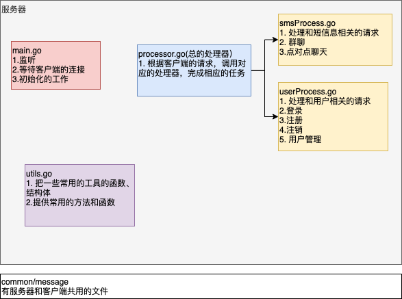

###### 步骤

1. 先创建分析出来的文件，然后放到相应的文件夹[包]

##### 实现功能-完成用户登录
  
1. 在 Redis 手动添加测试用户
2. 如输入的用户名密码在 redis 中存在则登录，否则退出系统，并给出相应提示信息

   1. 用户不存在或密码错误
   2. 你也可以重新注册，再登录
