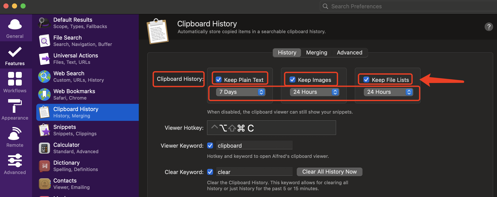

# Alfred 使用记录

## 问题记录

### Alfred搜索无文件索引

1. 重新在系统设置 -> 安全性和隐私 -> 隐私中重新添加辅助功能
2. Alfred搜索是调用的Spotlight，如果Alfred不能搜索我们只需要先关闭Spotlight，再开启Spotlight即可解决问题。
   打开终端，执行下方两条命令即可搞定：

   ``` bash
    #关闭命令：
    sudo mdutil -a -I off
    #开启命令：
    sudo mdutil -a -I on
   ```

### 剪切板功能无效的问题解决

1. 将 Alfred加入到系统设置 -> 安全性与隐私 -> 隐私 -> 辅助功能
2. Alfred -> perference -> Features -> Clipboard History -> 设置 Clipboard Histroy 的Keep 时间

